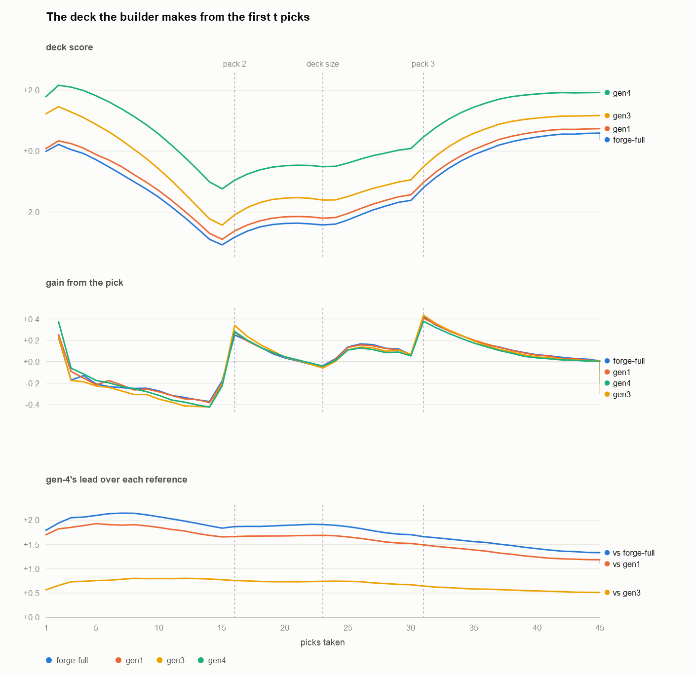
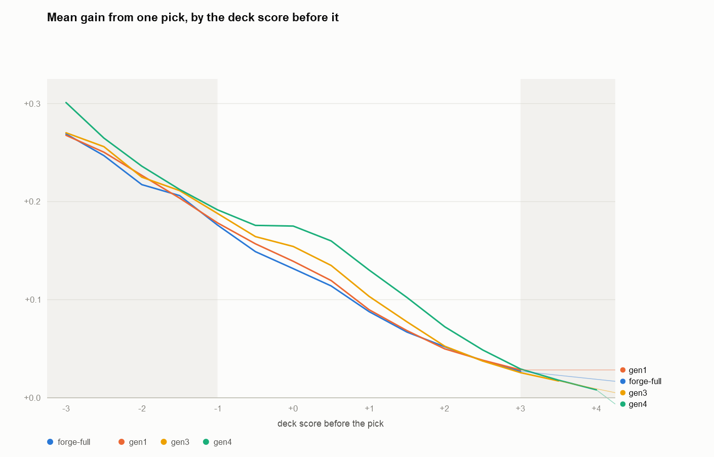

# Draft agent (gen-4) — online GRPO from the promoted gen-3 candidate

## Gen-3 settled the field, not the temperature

Gen-3 closed with one setting to carry forward and one question left open
([`2026-06-15-draft-agent-gen3-online-grpo-design.md`](2026-06-15-draft-agent-gen3-online-grpo-design.md),
*Where this leaves gen-3*).

Field at T is the training field: every ML agent samples at the rollout temperature, not
just the learner. It produced gen-3's best candidate and its tightest score distribution.

The temperature itself was unsettled. `T = 3` is the only value that holds the exploration
band of perplexity 2–3 and off-argmax 25–40 %, but it ran for 28 rounds under field at T.
`T = 2` lost the band mid-run and still produced the best candidate. The band and the
outcome disagreed.

Gen-4 warm-starts every run from the promoted gen-3 candidate
(`gen3/temperature-on-all-agents/lr1e-5_t2_20260805_221050.pt`) and uses it as the anchor as
well.

## All four runs peak and decline

Every gen-3 run peaked and declined, and all four gen-4 runs do the same. They share `lr 1e-5`,
the same base, and the mix `gen4:3,gen3a:2,gen3c:1,gen1:1,forge-full:1` with `--anchor gen3a`.

| Run                 | learner T | field T | Rounds | Duration | Best margin (round) | Final margin | Checkpoint taken |
|---------------------|-----------|---------|--------|----------|---------------------|--------------|------------------|
| `t2all_nodecay`     | 2.0       | 2.0     | 83     | 1h42m    | +0.546 (r72)        | +0.379       | r72              |
| `t2all_decay0.3`    | 2.0       | 2.0     | 1268   | 22h39m   | +0.831 (r312)       | +0.468       | r312             |
| `t3all_decay0.3`    | 3.0       | 3.0     | 568    | 9h54m    | +0.676 (r208)       | +0.206       | r58              |
| `t3learner_t2field` | 3.0       | 2.0     | 177    | 4h07m    | +0.391 (r68)        | +0.002       | r68              |

`t3all_decay0.3` is the one run whose yardsticked checkpoint is not its best-margin round, and
the choice is deliberate. Its margin climbed steadily to round 58, setting 24 new bests along
the way, then went 150 rounds without one before a single isolated reading of +0.676 at
round 208. That last step is +0.058 over round 58, well inside the ±0.15 noise floor the
metric carries at this window size. Round 58 sits at the top of a real climb; round 208 is one
lucky window for the learner's seats.

## Every gen-4 candidate beats every reference

All four checkpoints are measured. Each was taken through two 500-draft argmax runs: one
on the fixed mix `gen4:2,gen1:1,forge-full:1`, and one head-to-head against the promoted
gen-3 incumbent on `gen4:1,gen3:1`.

Every candidate also beats the gen-3 incumbent it was fine-tuned from, whose own yardstick is
the row to beat.

| Checkpoint          | vs gen-1         | vs `forge-full`  | vs gen-3 incumbent |
|---------------------|------------------|------------------|--------------------|
| `t2all_decay0.3`    | +1.380 ± 0.046   | +1.555 ± 0.052   | +0.634 ± 0.031     |
| `t2all_nodecay`     | +1.328 ± 0.049   | +1.519 ± 0.050   | +0.645 ± 0.031     |
| `t3learner_t2field` | +1.276 ± 0.052   | +1.384 ± 0.045   | +0.600 ± 0.033     |
| `t3all_decay0.3`    | +1.152 ± 0.050   | +1.337 ± 0.056   | +0.467 ± 0.030     |
| *gen-3 incumbent*   | *+0.824 ± 0.046* | *+0.920 ± 0.044* | —                  |

Each figure is a mean over pods of (mean candidate seat − mean reference seat) in that pod,
with the standard error clustered on set code. The naive un-clustered standard error treats every
pod as its own draw. That overstates the precision here, because a corpus samples a
random set per draft and most sets end up with several pods, and pods sharing a card pool move
together. Whatever makes a candidate unusually strong or weak in one set applies to every pod
drafted from it.

The last column can be checked against the first, because the gen-4-versus-gen-3 gap is
measurable two ways. Directly, from the head-to-head corpora where the two sit in the same
pods. Indirectly, by subtracting the incumbent's margin over gen-1 from each candidate's — a
different set of drafts, and one that assumes gen-1 scores consistently across corpora.

The indirect route puts the gap at roughly 0.3 to 0.55, the direct route at roughly 0.45 to
0.65, so the direct one reads about 0.1 higher throughout. Both rank the four candidates in
the same order. Two independent sets of drafts, played against different opponents, agreeing
on the ordering and roughly on the size means neither corpus is distorting its own result.

### Only the `T = 3` field separates from the rest

`t3all_decay0.3` is the one candidate the yardstick can tell apart, trailing the other three by
0.13 to 0.23 where the error bars run 0.04 to 0.07. The three above it sit inside their own
uncertainty of each other, and both corpora give the same picture despite being drawn
independently.

Gen-3's open temperature question is settled against the exploration band. The band pointed at
`T = 3`, and running every agent there is the worst of the four settings tried. Training longer
bought nothing either: `t2all_decay0.3` ran 312 rounds against `t2all_nodecay`'s 72 and finished
level with it.

## Raising the field's temperature costs; raising the learner's is free

The whole of the `T = 3` deficit belongs to the field's temperature, and none of it to the
learner's. The three runs sharing a field decompose it, because they change one temperature at
a time and their checkpoints come from within 15 rounds of each other.

| Contrast                               | What changes                   | Effect vs gen-1 | Effect vs gen-3 |
|----------------------------------------|--------------------------------|-----------------|-----------------|
| `t2all_nodecay` → `t3learner_t2field`  | learner 2 → 3, field held at 2 | −0.05 ± 0.07    | −0.05 ± 0.05    |
| `t3learner_t2field` → `t3all_decay0.3` | field 2 → 3, learner held at 3 | −0.13 ± 0.07    | −0.13 ± 0.05    |

The mechanism is the one the gen-3 spec proposed and gen-3's results appeared to refute
(§ 8.1). A field sampling at `T` sometimes passes a card it should have kept. The learner
then trains against packs a properly-playing field would never have handed it, and what it
learns from them does not transfer. Gen-3 compared field-at-T against field-at-argmax and
found sampling better; gen-4 varies the amount of sampling and finds less of it better. Both
are consistent with an optimum in the interior, near `T = 2`.

One incidental measurement supports the first row. In `t3learner_t2field` the learner and the
anchor hold identical weights and differ only in temperature, 3.0 against 2.0. Their round-0
margin is −0.042, so running the same policy hotter barely moves the deck it produces.

## `deck_score` does predict winning

Every ranking in this document is a `deck_score` difference, and gen-3 carried the assumption
that such differences turn into games won without ever testing it on drafted decks. They do, at
close to 15 points of match win rate per unit of score. Two runs measured it independently and
agree.

`python -m draft play-draft-games`
([`../specs/2026-08-09-draft-game-evaluation.md`](../specs/2026-08-09-draft-game-evaluation.md),
feature `022-draft-game-evaluation`) was run once over each of two `v-forge` yardstick corpora,
`t3learner_t2field`'s and `t2all_decay0.3`'s — third and first on the yardstick. Each run drew
1000 best-of-seven pairings from the recorded pods, mirrors excluded, with
`--forge-native-fraction 0.5` diverting half the `forge-full` seats to Forge's own deck builder.

| Label          | `t3learner_t2field` corpus | `t2all_decay0.3` corpus |
|----------------|----------------------------|-------------------------|
| gen-4          | 73.5 % ± 1.7 (781)         | 74.8 % ± 1.7 (810)      |
| `forge-full`   | 41.0 % ± 2.9 (329)         | 39.3 % ± 3.1 (298)      |
| gen-1          | 40.1 % ± 2.2 (581)         | 36.2 % ± 2.3 (575)      |
| `forge-native` | 18.8 % ± 2.4 (309)         | 21.8 % ± 2.4 (317)      |

The ordering is the yardstick's in both runs, on decks the scorer never saw played.

Every figure from these runs counts matches won, not individual games. Which deck wins a single
game depends heavily on what each player happens to draw. A match only ends when one deck has
won four games, so most of that luck averages out.

Reading each matchup's Bo7 rate against the score gap measured in the same corpus turns the
ordering into a rate. The gaps are pod-paired means from the yardstick corpus the matches were
drawn from, so each row's two labels are compared inside the same pods. `forge-native` is
absent because it has no `deck_score`, its deck being rebuilt from the pool at game time; its
matchups are taken up in *Swapping the deck builder is worth about as much as a generation of
drafting* below.

| Matchup                 | corpus              | score gap | Bo7 match win rate | matches |
|-------------------------|---------------------|-----------|--------------------|---------|
| gen-4 over `forge-full` | `t2all_decay0.3`    | +1.555    | 71.2 % ± 3.9       | 177     |
| gen-4 over `forge-full` | `t3learner_t2field` | +1.384    | 71.9 % ± 3.5       | 192     |
| gen-4 over gen-1        | `t2all_decay0.3`    | +1.380    | 72.4 % ± 2.4       | 421     |
| gen-4 over gen-1        | `t3learner_t2field` | +1.276    | 69.1 % ± 2.5       | 418     |
| gen-1 over `forge-full` | `t2all_decay0.3`    | +0.197    | 52.9 % ± 5.8       | 85      |
| gen-1 over `forge-full` | `t3learner_t2field` | +0.105    | 51.9 % ± 5.9       | 81      |

A line through the origin fits all six rows at 15.1 points of Bo7 match win rate per unit of
`deck_score`. Each corpus on its own gives 15.4 and 14.8, and the individual rows imply 13.6 to
18.1.

## Crowding a pod with strong drafters costs every seat in it

Gen-3 attributed the field's decline to denial and left the size of the effect open. The
yardstick corpora measure it, because `--agent-mix` is sampled per seat, so pods vary in how
many gen-4 seats they hold. All four checkpoints are pooled, about 7900 gen-4 seats per family.
Gen-1 and `forge-full` are one label here, since they decline in step.

| gen-4 seats in the pod | gen-4 | gen-1 + `forge-full` | gap   |
|------------------------|-------|----------------------|-------|
| 1                      | +2.77 | +1.44                | +1.33 |
| 2                      | +2.49 | +1.16                | +1.32 |
| 3                      | +2.33 | +1.04                | +1.30 |
| 4                      | +2.17 | +0.80                | +1.37 |
| 5                      | +2.05 | +0.63                | +1.43 |
| 6                      | +1.89 | +0.38                | +1.52 |
| 7                      | +1.62 | +0.19                | +1.43 |

| gen-4 seats in the pod | gen-4 | gen-3 | gap   |
|------------------------|-------|-------|-------|
| 1                      | +2.40 | +1.63 | +0.76 |
| 2                      | +2.06 | +1.51 | +0.55 |
| 3                      | +2.00 | +1.39 | +0.60 |
| 4                      | +1.85 | +1.29 | +0.56 |
| 5                      | +1.81 | +1.24 | +0.57 |
| 6                      | +1.74 | +1.12 | +0.62 |
| 7                      | +1.76 | +1.07 | +0.68 |

Every label falls as the pod fills, gen-4's own seats included. Crowding costs less against
gen-3 only because gen-3 is closer in strength: replacing a +0.8 reference seat with a +2.2
gen-4 seat adds more competition than replacing gen-3 at +1.3. Dividing each cost by that
strength gap makes the two families agree.

| Family    | seat displaced       | gen-4's lead over it | cost to a rival seat | ratio | cost to a gen-4 seat | ratio |
|-----------|----------------------|----------------------|----------------------|-------|----------------------|-------|
| `v-forge` | gen-1 + `forge-full` | +1.377               | −0.205               | 0.149 | −0.159               | 0.116 |
| `v-gen3`  | gen-3                | +0.587               | −0.095               | 0.162 | −0.075               | 0.128 |

A seat entering a pod costs each rival about a sixth of the amount by which it outclasses the
seat it replaced, and its own kind about an eighth. Gen-4 is therefore more robust to a crowded
pod than the field it beats, which is why the gap column widens as the pod fills. Two families
support that ratio, so read it as a suggestion rather than a measurement.

The same effect explains why the frozen labels lose ground during a training run. The number of
learner seats never changes, it is three throughout, but the learner sitting in them gets
stronger, and a stronger seat takes more cards from everyone else just as an extra seat would.
`gen3a` losing 0.40 over the long run is that effect, not a sign that something went wrong.

## Gen-4's margin depends on the set, and core sets are its weakest ground

Every pod yields one number: the gap between gen-4's seats and `forge-full`'s seats in that pod.
Those gaps vary a lot from pod to pod. About a fifth of that variance comes from which set the
pod drafted, and the rest is pods of the same set differing from each other.

The measurement pools the four `v-forge` corpora, giving 1778 pods over 181 sets, a median of
ten pods per set. The corpora come from four checkpoints of different strength, so each is
centred on its own mean first. Without that, a stronger checkpoint that happened to draw an
unusual mix of sets would look like a set effect.

The set effect is far larger than chance produces. An analysis of variance across the 181 sets
gives F = 3.2 on 180 and 1597 degrees of freedom. This is the variation the yardstick's
set-clustered standard errors account for.

Two further checks say a per-set ranking repeats rather than reflecting one lucky draw.
Splitting the four checkpoints into two pairs and scoring every set once per pair, the two
scores correlate at +0.49. Scoring every set against `forge-full` and again against gen-1, which
are different opponents sitting in the same pods, gives +0.68.

Grouping sets by what kind of product they are gives the generalisation. The types are Forge's
own, read off `CardEdition.getType()` rather than assigned here. Expansion is an ordinary
Standard-legal set and is most of the data. Draft means a set built as a standalone limited
format, which here is Modern Horizons, Conspiracy, Commander Legends, Battlebond, Mystery
Booster and Lord of the Rings. Reprint means a Masters-style product. Online means Arena and
MTGO exclusives, mostly Alchemy sets and the Masters Editions. Starter is Portal and
Starter 1999.

| Edition type | sets | pods | mean margin |
|--------------|------|------|-------------|
| Draft        | 11   | 122  | +1.63       |
| Reprint      | 15   | 166  | +1.62       |
| Online       | 23   | 215  | +1.48       |
| Expansion    | 106  | 1032 | +1.44       |
| Core         | 22   | 205  | +1.29       |
| Starter      | 3    | 33   | +1.12       |

Read the ends of that table rather than the ordering within them. Draft, Reprint and Online sit
within 0.15 of each other on 11, 15 and 23 sets, which is too close and too thin to rank.

Gen-4 gains least where the cards are simplest. Core and starter sets are built to teach the
game: flat power curves, few build-arounds, little that rewards knowing the format. There is
less for a drafter to get right, so Forge's heuristics give up less. The three types at the top
share the opposite property, since a set designed as its own limited format, a Masters reprint
product and an Alchemy rebalance all carry sharper power differences than a Standard set does.

Individual sets are shrunk toward the grand mean before ranking. A set's own mean is a noisy
estimate of its true margin, and the fewer pods it has the noisier it is, so ranking on raw
means would put the luckiest small samples at both ends. Shrinkage replaces each set's mean with
a weighted average of that mean and the grand mean, weighted by the share of the set's apparent
deviation the data can attribute to the set rather than to sampling:

```
weight = τ² / (τ² + σ²/n)
```

`τ²` is the between-set variance estimated above, `σ²` the within-set variance, and `n` the
set's pod count. At the median ten pods the weight is about 0.7, so the ranking stays mostly the
sets' own means and only the thinnest samples move far. This is the empirical-Bayes estimator.
Raw means sit beside the shrunk ones to show how much work it does: Planeshift has six pods, a
raw margin of +3.04 and a shrunk one of +2.36.

| Set                        | Type      | Shrunk | Raw    | Pods |
|----------------------------|-----------|--------|--------|------|
| MB1 Mystery Booster        | Draft     | +2.37  | +2.59  | 19   |
| PLS Planeshift             | Expansion | +2.36  | +3.04  | 6    |
| KLR Kaladesh Remastered    | Online    | +2.13  | +2.39  | 12   |
| DST Darksteel              | Expansion | +2.13  | +2.63  | 6    |
| PCY Prophecy               | Expansion | +2.09  | +2.29  | 14   |
| *… 175 sets between …*     |           |        |        |      |
| 9ED Ninth Edition          | Core      | +0.91  | +0.64  | 9    |
| M11 Magic 2011             | Core      | +0.87  | +0.65  | 12   |
| KTK Khans of Tarkir        | Expansion | +0.85  | +0.63  | 12   |
| FRF Fate Reforged          | Expansion | +0.71  | +0.46  | 13   |
| 3ED Revised Edition        | Core      | +0.63  | +0.17  | 8    |

The bottom of the table is core sets, which the edition types already account for, plus Khans of
Tarkir and Fate Reforged, which they do not. Why those two sit there is unexplained.

`forge-native` cannot be ranked this way. It carries no `deck_score`, so the only per-set
measure available is games won. The two played corpora give 383 gen-4 versus `forge-native`
matches spread over 142 sets. Under three matches a set puts the standard error on a per-set win
rate above 20 points, wider than the whole effect. Ranking sets by games needs a run that fixes
the set rather than sampling it.

## Swapping the deck builder is worth about as much as a generation of drafting

Two seats can draft identically and still end up with different decks, because which 40 cards
go in is decided after the draft ends. `forge-full` and `forge-native` are that pair. Both are
Forge's drafting AI, and both work from the same drafted pools. They differ only in which
program picks the 40 cards: this project's picker and simulated-annealing builder for
`forge-full`, Forge's own builder for `forge-native`. Playing the two against each other
therefore measures the builders and nothing else. The two `play-draft-games` runs put 92 of
those matches on record.

This project's builder wins that matchup in both of them.

| Corpus              | This project's builder wins | Matches |
|---------------------|-----------------------------|---------|
| `t3learner_t2field` | 75.0 %                      | 56      |
| `t2all_decay0.3`    | 72.2 %                      | 36      |
| Pooled              | 73.9 %                      | 92      |

Gen-4 wins 70.8 % of its 839 matches against gen-1, which is what one generation of drafting
improvement is worth. That is close to the builder's 73.9 %, and 92 matches put an error bar of
about 5 points on the builder figure, so the two cannot be told apart. Changing who builds the
deck buys roughly what a generation of better drafting buys.

The builder also decides the bottom of the table. `forge-native` loses to every other label,
including `forge-full`, which drafted the same pools with the same agent. Gen-4's largest
margin over any label is against `forge-native` rather than against any drafting agent.

### Forge pads a tenth of its decks with basics rather than lowering its bar

About a tenth of `forge-native` decks are not decks. Of the 615 built across the two runs, 65
hold 21 or more lands in 40 cards, out to 33. Forge picks 22 spells if it can and fills the
rest of the deck with basic lands. Those decks win a tenth of their matches, and none at all
past 25 lands, which costs `forge-native` around four points of win rate on its own.

Two things leave Forge short of 22 spells. The first is the colour commitment: the drafter
fixes two colours early and the builder is handed the same pair, so a pool that ran dry in
those colours has too little to play. Every seat holding fewer than 22 on-colour cards built a
land-heavy deck, without exception. The second is that Forge discards cards its own AI handles
badly. These are build-around cards, flagged `RemRandomDecks`: the builder keeps one when the
partners it needs are already in the deck and drops it when they never arrived. The drafter
never reads that flag, so it takes such cards on raw power and only finds the hole at build
time. Land-heavy seats that did hold 22 on-colour cards carried more than three times the usual
share of them.

## More creatures, fewer rares, narrower mana bases

Both gen-3 deck-shape trends continue, and the games back the creature count. From the four
`v-forge` corpora, where gen-4 shares pods with both references.

|                           | `t2all_nodecay` | `t2all_decay0.3` | `t3all_decay0.3` | `t3learner_t2field` | gen-1       | forge-full  |
|---------------------------|-----------------|------------------|------------------|---------------------|-------------|-------------|
| creatures                 | 18.01           | 18.19            | 17.79            | 17.91               | 15.22–15.28 | 15.09–15.16 |
| avg mana value            | 3.17            | 3.21             | 3.19             | 3.19                | 3.02–3.05   | 3.03–3.07   |
| rares                     | 1.24            | 1.24             | 1.25             | 1.33                | 1.69–1.74   | 1.86–1.95   |
| ≥ 4 basic land types      | 4.5 %           | 5.6 %            | 4.7 %            | 6.4 %               | 7.0–9.8 %   | 9.0–10.9 %  |
| score of those wide decks | +1.30           | +1.65            | +1.47            | +1.65               | −0.03…+0.28 | +0.03…+0.14 |

Reference columns give the range across the four corpora, each measured in the same pods as
the candidate beside it.

Gen-4 builds more creatures and fewer rares than either reference, putting on-colour commons in
place of higher-rarity cards at an essentially unchanged curve. Every candidate builds narrower
mana bases than the gen-1 seats sitting in the same pods, where gen-3's incumbent led its
references by 3.6 points and these lead by 1.4 to 4.1.

Decks holding more creatures win more, in both played runs and inside every label.

| Bo7 win rate                   | ≤ 13 creatures | ≥ 20 creatures |
|--------------------------------|----------------|----------------|
| all decks, `t3learner_t2field` | 25.7 %         | 74.2 %         |
| all decks, `t2all_decay0.3`    | 26.2 %         | 70.8 %         |
| gen-4, `t3learner_t2field`     | 50.0 %         | 79.5 %         |
| gen-4, `t2all_decay0.3`        | 54.3 %         | 75.6 %         |

The wide decks are the more informative row. When gen-4 does build four or five basic land
types it scores between +1.30 and +1.65 there, where gen-1's wide decks score around zero.
Going wide is not the failure; going wide when the pool does not support it is, and none of
these four does that. Gen-4's advantage is in fact uniform across every width bucket — on
`t2all_nodecay`, +2.23 against +1.26 at two land types and +1.79 against +0.61 at three — so
the mana base is a symptom of pool quality rather than the thing that differs.

No gen-4 candidate repeats the failure that separated gen-3's two families, where one candidate
built four- and five-colour decks 2.4 times as often as the others and averaged −1.88 on its
five-colour ones
([`2026-06-15-draft-agent-gen3-online-grpo-design.md`](2026-06-15-draft-agent-gen3-online-grpo-design.md),
*Mean against median*). *Hypothesis 2* below uses that run as a control.

## Gen-4 gains on fresh packs and gives part of it back on the leftovers

Gen-4 is ahead of every reference after a single card and never falls behind, but it does not
win its lead once and hold it. The lead grows through the opening of packs 1 and 2 and shrinks
through the second half of each. Scoring every prefix of a seat's pool turns a draft into a
curve rather than one end score (`scripts/analyze_prefix_deck_value.py`, charted by
`scripts/plot_prefix_deck_value.py`).

The measurement has two halves, joined at pick 23. Below 23 cards there is no deck to build, so
the pool is scored directly and every card drafted must be played. From 23 on the builder
chooses 23 non-lands out of a growing pool, so a pick is worth something only when it displaces
the deck's current worst card. At exactly 23 the builder has no choice either, and the two paths
agree to six decimal places on every seat tested, which is what licenses joining them.



Each pack has the same internal shape and its two halves do different work. The opening picks of
pack 1 are the seat's bombs, so the buildable deck starts high, and it then falls for thirteen
picks because every card drafted must be played and each is worse than the last. Pack 2 opens
with fresh cards and the fall reverses. Eight picks in, the pool passes 23 cards and the rule
changes: the builder can discard, so the cards forced at the end of pack 1 stop counting against
the deck. Pack 3 opens with another jump, and its last third changes almost nothing.

Gen-4's lead tracks that structure. It runs from +1.79 after one pick to +2.15 by pick 7, falls
to +1.84 over the rest of pack 1, recovers to +1.92 by pick 22, and then declines for the whole
of the draft that remains. It gains where cards are plentiful and gives ground where the pack is
picked over and the choice is closer to taking whatever is left.

Pack 3 brings no recovery, and the reason is that by then every pick is a replacement.



Plotting the gain against the score the pick started from splits the draft into three regimes,
of which the chart shades the outer two. Left of −1 a bad deck is easy to improve and all four
agents do it equally. Right of +3 there is nothing left to add and none of them finds it.
Between them, where a better card is hard but not impossible to find, gen-4 leads every
reference and gen-3 sits between it and the two weakest. That is the yardstick's ordering,
reproduced at matched difficulty.

That is also why a better drafter's lead can only narrow once the deck is full. The card a new
pick evicts is better for gen-4 than for a reference, so the same incoming card buys it less.
Gen-4's raw gain per pick is accordingly the smallest of the four, +0.113 against Forge's
+0.140, while its like-for-like gain is the largest.

Three limits. Levels below pick 23 are not comparable across picks, because the set the scorer
sees grows by one each time and it never saw a sub-23-card deck in training. The method measures
the pool a seat accumulated, not the difficulty of the choices it faced. And the builder is not
an optimiser: adding a card to a pool cannot lower the best deck obtainable from it, yet 22 % of
the steps past pick 23 fall, once by −3.8. It is a picker network and a simulated-annealing
pass, so it sometimes finds a worse deck from a larger pool. Read the curves for their shape
rather than for any individual step.

## The three gen-3 hypotheses survive, but only card judgement tracks quality

### Hypothesis 1 — lane starvation. Confirmed as a mechanism, refuted as a quality signal.

Lane starvation behaves exactly as gen-3 described it, and it predicts nothing about how good
the resulting policy is.

The hypothesis has four steps. A field that plays its best takes the good cards in the
learner's colours. The learner then keeps facing packs with nothing playable on-colour. It
takes the off-colour card because it has no alternative. From enough such positions it acquires
a general taste for off-colour cards.

Gen-4 varies field strength on a new axis. A field at `T = 3` misplays more than a field at
`T = 2`, so it starves the learner less. The hypothesis therefore predicts that the `T = 3`
field produces the least off-lane taste. It does, by a wide margin.

A pick is off-lane when the card taken falls outside the seat's own eventual top-2 colours. The
first figure in each cell is the share of picks 6–10 of pack 1 that went off-lane. The figure in
brackets is the share of those off-lane picks that were made while an on-colour card was still
in the pack, so the higher it runs the more of the off-lane picks were chosen rather than
forced. The columns are the three kinds of seat drafting in the same pods: the gen-4 candidate,
and the gen-1 and `forge-full` references beside it.

| Corpus              | gen-4          | gen-1           | forge-full      |
|---------------------|----------------|-----------------|-----------------|
| `t2all_nodecay`     | 11.9 % (49.7)  | 9.5 % (46.0)    | 11.7 % (57.7)   |
| `t2all_decay0.3`    | 12.6 % (54.2)  | 8.3 % (46.3)    | 11.1 % (57.3)   |
| `t3all_decay0.3`    | 8.6 % (34.0)   | 9.9 % (49.0)    | 12.9 % (58.4)   |
| `t3learner_t2field` | 12.0 % (48.9)  | 9.8 % (49.6)    | 12.2 % (51.7)   |
| *gen-3 incumbent*   | *9.6 % (34.2)* | *10.8 % (45.4)* | *11.5 % (50.4)* |

`t3all_decay0.3` is the most lane-disciplined agent in the table by both readings. It declines
an available on-colour card in a third of its off-lane picks, where the others decline in about
half. It also goes off-lane less often than the gen-1 seats beside it. That agent is the worst
of the four on the yardstick.

The three candidates trained against a `T = 2` field went the other way. All three go off-lane
more often than gen-1, and at least as often by choice. All three also left the incumbent's
position: gen-4 inherited a policy that declined on-colour cards a third of the time and moved
it to about half, which is where the gen-1 and `forge-full` references have always sat.

The differences are behaviour, not supply. An agent with an unusual lane could face packs
holding more cards outside its top-2 and go off-lane more often without choosing anything
differently. Measured at each decision, the share of available coloured cards outside the seat's
top-2 is 55–58 % for every agent in every corpus. The ratio of off-lane picks to off-lane supply
separates the agents exactly as the raw rate does.

The mechanism is real and the reading gen-3 built on it is not. Off-lane rate rises and falls
with field strength as predicted, and it does not track deck quality. Gen-3 saw its bad
candidate go off-lane most and inferred that going off-lane is the fault. Under gen-4 the best
candidates go off-lane most and the most disciplined one places last. The discriminator has to
come from the next two hypotheses.

### Hypothesis 2 — card power over lane fit. Holds, and it ranks the candidates.

Whether an agent breaks colour for a better card separates a healthy policy from a failed one,
and it puts the four gen-4 candidates in nearly the yardstick's order. It also separates gen-4
from Forge. The two take the off-colour bomb about equally often, and gen-4 declines the
off-colour filler far more.

The hypothesis: breaking colour is correct when the card is enough better than the on-colour
alternative. A healthy policy should therefore show a positive quality premium on its voluntary
off-lane picks, and a failing one should not. Cards are scored by `shrunk_score_play`, net
winning influence on the play, which covers 98 % of drafted card slots. The table below comes
from `scripts/analyze_pick_quality.py`.

| Corpus                          | agent                | best-card rate | mean premium    | share above zero |
|---------------------------------|----------------------|----------------|-----------------|------------------|
| `t2all_decay0.3`                | gen-4                | 25.1 %         | +0.0318         | 68.2 %           |
| `t3learner_t2field`             | gen-4                | 24.4 %         | +0.0287         | 66.2 %           |
| `t2all_nodecay`                 | gen-4                | 25.3 %         | +0.0260         | 65.7 %           |
| `t3all_decay0.3`                | gen-4                | 24.0 %         | +0.0225         | 62.1 %           |
| gen-3 incumbent                 | gen-3                | 22.9 %         | +0.0240         | 63.0 %           |
| gen-3, field at argmax, `T = 3` | gen-3                | 28.5 %         | +0.0049         | 51.9 %           |
| *references, all corpora*       | *gen-1 / forge-full* | *18.8–21.7 %*  | *+0.007…+0.015* | *53.4–58.7 %*    |

Every gen-4 candidate breaks colour more selectively than either reference and than gen-3's
incumbent, and at a larger premium. The bottom row is gen-3's failed candidate, the
field-at-argmax run whose wide decks averaged −1.88. It breaks colour at a coin flip and gains
nothing by it, while taking the pack's highest-win-rate card more often than any agent here.
Gen-4 gives that pair of facts a control. Its best-card rate sits below the failure's and its
premium far above it, so only the premium tracks quality.

The premium ranks the four candidates, which nothing else at the pick level does.
`t3all_decay0.3` is last on the premium and on the share above zero, matching the yardstick, and
its 6.1-point deficit in share above zero carries a standard error of 1.1 points. The middle two
swap places against the yardstick, so the ordering identifies the loser rather than resolving the
top. A field sampling at `T = 3` gives worse evidence about when breaking colour pays, and the
policy trained on that evidence breaks colour slightly worse.

The premium scores the breaks an agent took. The decision to break at all is a second
measurement, and it is the one that separates gen-4 from Forge. The lane it uses is the one the
seat had already committed to rather than the one it finished in, since only the first explains a
choice at the moment it was made. That lane is the top-2 colours of the cards picked so far, read
once the seat holds five coloured cards with two in its second colour. A decision counts when the
pack held both an on-lane and an off-lane scored card, and each cell is the share of those
decisions where the card taken was off-lane. The columns split them by how the best off-lane card
scored against the best on-lane one, and the ratio divides the two rightmost columns by the two
leftmost, so an agent that ignores card quality when it breaks scores 1. Only picks 1–10 count,
since the leftovers at the end of a pack are too close in value for the comparison to carry
anything. This table and the two paragraphs after it come from
`scripts/analyze_lane_discipline.py`.

| Agent and pack        | much worse | worse | level | better | much better | ratio |
|-----------------------|------------|-------|-------|--------|-------------|-------|
| `forge-full`, pack 1  | 1.5 %      | 2.0 % | 3.8 % | 6.2 %  | 11.3 %      | 4.8×  |
| `forge-full`, pack 2  | 1.8 %      | 3.1 % | 4.9 % | 7.6 %  | 15.5 %      | 4.4×  |
| `forge-full`, pack 3  | 2.7 %      | 3.5 % | 5.2 % | 8.0 %  | 15.4 %      | 3.6×  |
| `gen1`, pack 1        | 0.7 %      | 1.6 % | 2.1 % | 3.8 %  | 7.5 %       | 4.2×  |
| `gen1`, pack 2        | 1.2 %      | 2.5 % | 3.9 % | 5.7 %  | 12.2 %      | 4.4×  |
| `gen1`, pack 3        | 1.5 %      | 2.0 % | 3.1 % | 5.0 %  | 11.9 %      | 4.5×  |
| `gen4`, pack 1        | 0.5 %      | 1.3 % | 3.0 % | 5.0 %  | 11.7 %      | 8.1×  |
| `gen4`, pack 2        | 1.3 %      | 2.3 % | 3.6 % | 6.0 %  | 14.9 %      | 5.3×  |
| `gen4`, pack 3        | 1.1 %      | 1.7 % | 3.1 % | 5.4 %  | 13.1 %      | 6.2×  |

Gen-4 takes the much better off-colour card as often as Forge, and the much worse one at half
Forge's rate or less in every pack. Forge is the only agent with a trend across the draft, and
it runs the wrong way: it takes more much-worse cards in each later pack while its ratio falls.
Gen-4's most selective pack is its first. Gen-1 breaks colour least often of the three, but its
ratio sits with Forge's, so it declines the good off-colour card about as readily as the bad
one.

The volume is far too small to explain the score gap. Forge makes 0.18 of these breaks per draft
against gen-4's 0.11, and after the build that is a difference of 0.07 picks out of forty-five.
Read these tables as a signature of the judgement the premium already measures, not as a second
mechanism behind gen-4's decks.

One limit. `shrunk_score_play` decides which card was better, and gen-4 follows that axis more
closely than either reference, so part of the gap is agreement with the scoring label rather
than better judgement. Gen-4's breaks on a worse card reach its deck more often than its breaks
on a better one, 55 % against 46 %, which is what mislabelled picks would look like.

### Hypothesis 3 — a colour prior learned from Forge. Confirmed and stronger.

Gen-4 leans towards green, black and white harder than any gen-3 candidate did, and the lean
stops growing near +4 percentage points.

The hypothesis: Forge pilots green, black and white better than blue and red, because blue and
red lean on instants and sorceries and Forge plays those worst. `deck_score` is fitted to
Forge-piloted outcomes. A policy trained on it should therefore acquire a taste for those three
colours, and the taste should show when it breaks lane.

The test compares, at each off-lane pick, the colour of the card taken against the colour mix of
the off-lane cards available in that pack at that moment. Each pick contributes weight 1 to both
sides, and gold cards split their weight across their colours. Mean per off-lane pick of
(green-black-white taken − green-black-white available):

| Corpus              | gen-4    | gen-1 | forge-full | learner picks, this generation |
|---------------------|----------|-------|------------|--------------------------------|
| `t3all_decay0.3`    | +2.91 pp | −0.22 | −0.10      | ~75k                           |
| `t3learner_t2field` | +3.61    | +0.23 | −0.78      | ~90k                           |
| `t2all_nodecay`     | +4.09    | −0.18 | +0.51      | ~95k                           |
| `t2all_decay0.3`    | +3.99    | −0.21 | −0.58      | ~405k                          |

Standard errors are 0.23–0.33 pp. Every gen-4 figure is more than twelve standard errors from
zero and no reference figure is more than two and a half. Gen-3's four candidates ran +0.70 to
+2.90 on the same measurement, so all four gen-4 candidates exceed gen-3's largest.

The lean tracks cumulative training and then saturates. Ordered by learner picks it grows across
the first three candidates and stops there, and the fourth trained four times as long as the
third for nothing further. Gen-3 found the lean's size tracked training length rather than which
field a candidate trained against. Gen-4 reproduces that on all three temperature configurations
and adds the ceiling, somewhere near +4 pp.

The lean shows in the finished decks, not only at the pick. Share of decks playing each colour,
across the four corpora:

| Colour | gen-4       | gen-1 and `forge-full` seats in the same pods |
|--------|-------------|-----------------------------------------------|
| White  | 59.8–63.4 % | 45.9–49.9 %                                   |
| Red    | 30.8–33.4 % | 52.6–56.0 %                                   |

Blue follows red down, and green and black follow white up. Two generations of self-play have
turned a mild preference into a near-inversion of the reference colour distribution.

The lean costs gen-4 nothing in games. Its Bo7 win rate is about the same in all five colours,
and the differences are small enough to be sampling noise given how many matches each colour
appears in. White is the colour it plays most, and it wins slightly more often in white than it
does overall.

The lean is correct play against this opponent, and the same preference would be miscalibrated
against a human. Forge wins more with green, black and white. `deck_score` measures
Forge-piloted outcomes. A policy that learns which colours win those games is doing what it was
asked. The finding to carry forward is the size and the ceiling, not a problem to fix.

What the games cannot say is whether this lean is the best one available. Testing that would
mean forcing gen-4 into colours it did not pick and seeing whether it wins more, and no run
does that.

### Playing a forced pick marks a weak pool

Playing a card the seat was forced to take marks a weak pool, and those picks are a fifth of the
draft. Hypothesis 2 cannot see them. Its premium and its leave-lane table both require an
on-colour card to have been available, so a pick made when nothing on-colour was left enters
neither, which leaves 7.2 of gen-4's 45 picks outside both. Every figure in this section comes
from `scripts/analyze_lane_discipline.py`, run against the same bo1 `cards-win-rates.txt`.

Sometimes the pack still holds a card in the seat's colours and the seat passes it over.
Sometimes nothing on-colour is left and the seat takes what remains. Only the first is a
decision, and the two kinds hold different cards. Each cell below gives the mean
`shrunk_score_play` of the card taken, then how often that card was the highest-scoring one in
the pack.

| Agent        | chosen: score / took best | forced: score / took best |
|--------------|---------------------------|---------------------------|
| `forge-full` | +0.0252 / 28.5 %          | −0.0105 / 36.3 %          |
| `gen1`       | +0.0269 / 28.9 %          | −0.0108 / 36.1 %          |
| `gen4`       | +0.0430 / 42.3 %          | −0.0063 / 40.2 %          |

Forced picks outnumber chosen ones by more than three to one. A chosen off-lane card scores above
the average drafted card for every agent, and a forced one below it. Gen-4's chosen cards are the
strongest of the three, and it takes the pack's highest-scoring card on them half again as often
as either reference. That is the premium once more, read off the card taken rather than off the
gap it opened.

Gen-4 plays more of the off-lane cards it chose than either reference, and fewer of the ones it
was forced into.

| Agent        | on lane | chosen off-lane | forced off-lane |
|--------------|---------|-----------------|-----------------|
| `forge-full` | 62.8 %  | 35.2 %          | 16.0 %          |
| `gen1`       | 62.6 %  | 35.4 %          | 13.8 %          |
| `gen4`       | 61.5 %  | 41.1 %          | 10.6 %          |

All three play an on-lane pick at nearly the same rate, so the whole difference sits in the two
off-lane columns. Every seat's deck is assembled by the same frozen picker, so this belongs to
the cards drafted rather than to the builder.

The forced column is mostly a mana-base effect. Forge builds 2.51 colours to gen-4's 2.38, and a
wider deck can absorb a stray off-colour card. Among two-colour decks alone the three converge to
between 2 and 3 %, and gen-4 no longer sits lowest. The chosen column is what survives that
control, and gen-4 leads it.

A card taken because nothing on-colour was left is one the seat never wanted. The builder fills
the deck with the best 23 spells in the pool, so a forced card that makes the cut has been ranked
above cards the seat chose deliberately. That marks the chosen cards as weak, without saying
whether the weakness came from the picks or from the packs the seat was passed. Grouping seats by
how many forced picks ended up in their deck, against their own pod's mean `deck_score`:

| Agent        | played none | played one | played two or more |
|--------------|-------------|------------|--------------------|
| `forge-full` | −0.544      | −0.963     | −1.349             |
| `gen1`       | −0.425      | −0.794     | −1.197             |
| `gen4`       | +0.782      | +0.500     | +0.278             |

The decline is monotone for all three agents and steep, at a quarter to four tenths of a point
per forced pick played. The whole gen-3 to gen-4 step was about +0.6, so a seat that plays one of
these sits about half a generation below one that plays none. Read the slopes rather than the
levels, which differ only because the score is pod-relative and gen-4 outscores its pod
throughout.

A forced pick that never reaches the deck costs the seat nothing, and about nine in ten of
gen-4's never do. Taking the best card left pays either way. One that turns out playable goes
into the deck. One that does not is still a good card the rest of the pod will not see, and the
training reward is a seat's `deck_score` minus the mean of the other seats', so denying a
neighbour is worth a seventh of playing the card yourself. None of the three follows that far.
Gen-4 comes closest and still leaves the best card behind on three fifths of its forced picks.

### `cast_lift` is the axis gen-4 gained on

Hypothesis 2 scores cards on `score_play` alone, and the encoder is trained on five axes
([`../specs/2026-05-03-card-winnability-pretraining.md`](../specs/2026-05-03-card-winnability-pretraining.md)).
This test covers every pick rather than only the off-lane ones. It asks where the taken card sat
among the cards still in the pack under each axis, as a percentile. An agent indifferent to an
axis scores 0.5; one that always takes the pack's maximum scores 1.0. `color_lift` is the mean
of `color_lift_X` over the seat's eventual top-2 colours, so it measures how well the taken card
pairs with the colours the seat committed to. The table below and every correlation quoted in
this section come from `scripts/pick_metric_alignment.py`, run against the bo1
`cards-win-rates.txt` fitted on about a million games.

Two filters restrict the measure to picks that were real choices, and both matter to the levels
below. A card carries a label only with at least 20 in-deck observations. That threshold removes
the basic lands, which fill a few per cent of booster slots and are taken at mean pick 14.6 of
15, so no agent is choosing them. A pick is scored only if at least five cards left in the pack
carry a label, which drops the tail of each pack where the choice is between two or three
leftovers. Both cuts do the same job. A forced pick lands near the middle of the pack whatever
the agent prefers, so leaving those picks in pulls every agent towards 0.5 and compresses the
differences this table is about. Dropping both filters lowers the reference levels by about 0.05
and shrinks the candidates' leads over them by a fifth or more.

The reference columns give each reference's range across the five corpora, measured in the same
pods as the candidates beside them. Each candidate cell gives its percentile, then in brackets
its lead over the gen-3 incumbent's column and its lead over the gen-1 seats in its own corpus;
only the second is paired within a corpus. The incumbent's own cell carries its paired lead over
gen-1, measured the same way in its corpus.

| Axis          | `t2all_decay0.3`       | `t2all_nodecay`        | `t3learner_t2field`    | `t3all_decay0.3`       | gen-3 incumbent | gen-1       | forge-full  |
|---------------|------------------------|------------------------|------------------------|------------------------|-----------------|-------------|-------------|
| `score_play`  | 0.703 (+0.041, +0.100) | 0.688 (+0.026, +0.080) | 0.684 (+0.022, +0.078) | 0.679 (+0.017, +0.073) | 0.662 (+0.052)  | 0.603–0.610 | 0.593–0.610 |
| `score_draw`  | 0.698 (+0.039, +0.097) | 0.685 (+0.026, +0.079) | 0.683 (+0.024, +0.082) | 0.675 (+0.016, +0.072) | 0.659 (+0.053)  | 0.601–0.606 | 0.592–0.607 |
| `played_rate` | 0.643 (+0.011, +0.056) | 0.653 (+0.021, +0.064) | 0.644 (+0.012, +0.055) | 0.636 (+0.004, +0.047) | 0.632 (+0.050)  | 0.583–0.589 | 0.573–0.583 |
| `cast_lift`   | 0.604 (+0.043, +0.079) | 0.588 (+0.027, +0.064) | 0.588 (+0.027, +0.062) | 0.581 (+0.020, +0.057) | 0.561 (+0.032)  | 0.523–0.529 | 0.518–0.530 |
| `color_lift`  | 0.508 (−0.021, −0.053) | 0.512 (−0.017, −0.046) | 0.517 (−0.012, −0.046) | 0.530 (+0.001, −0.027) | 0.529 (−0.033)  | 0.557–0.563 | 0.559–0.568 |

Read down a column, not across a row. A noisier or more tied label regresses towards 0.5 on its
own, so the axes are not on a common scale. Gen-1 and `forge-full` agree to within 0.01 on every
axis, so the references are one baseline, and every trained agent sits above it on the four
quality axes and below it on the colour axis. `score_play` and `score_draw` correlate at Spearman
0.72 and every agent tracks them equally, so they are one finding rather than two.

The generation's gain is on `cast_lift`, where gen-3's incumbent led gen-1 by +0.032 and gen-4
leads by up to +0.079. `cast_lift` measures the effect of casting a card, net of the quality of
the deck it was cast in. It scores a card that changes the game it is cast in above one that
only appears in decks that were winning anyway. It correlates with `score_play` at 0.64, so most
but not all of that movement is shared with raw power.

Two axes order the four candidates as the yardstick does, `score_play` and `cast_lift`. On
`cast_lift` only the paired figure resolves it, since `t2all_nodecay` and `t3learner_t2field`
are tied on the raw percentile and separate against the seats they actually drafted alongside.
Neither ordering carries much weight on its own. The middle two candidates sit 0.001 apart on
`score_play` and 0.003 apart on `cast_lift`, against a standard error of 0.002 on both, so each
ordering rests on a gap it cannot resolve. Four candidates ordering correctly by chance is a
one-in-twenty-four event, so this is worth another generation's data rather than a conclusion.

The colour axis is confounded and settles nothing. Its labels correlate negatively with
`score_play` (−0.13 to −0.28) and more strongly negatively with `played_rate` (−0.27 to −0.41),
so an agent climbing the power axes is pushed down the colour axis mechanically. It is also not
the colour prior of Hypothesis 3, which is about which of WUBRG the agent prefers, where
`color_lift` asks whether a card pairs with the colours already committed to.