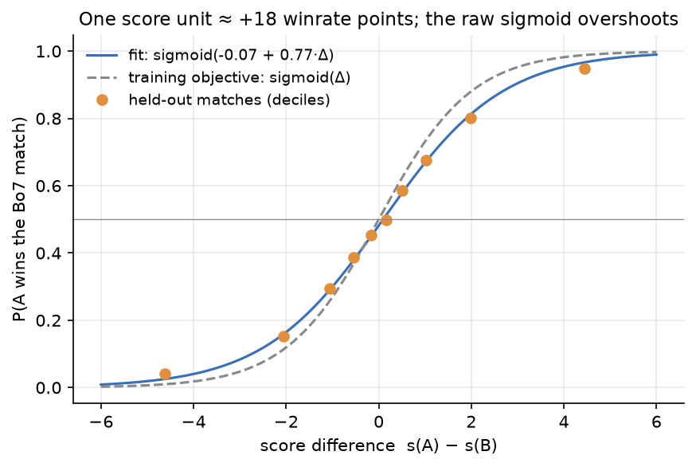
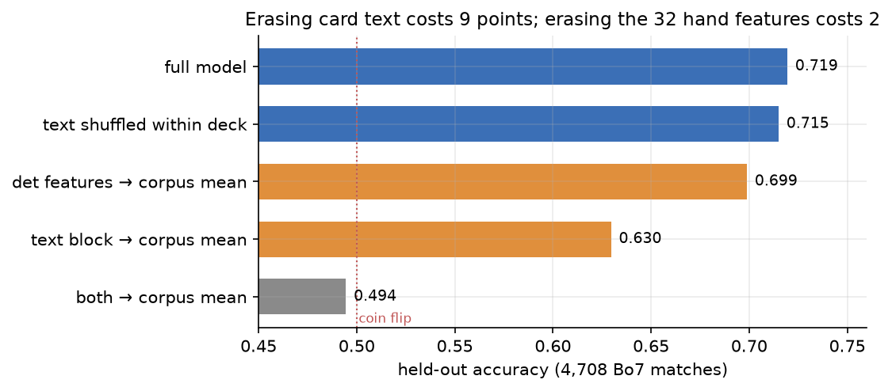
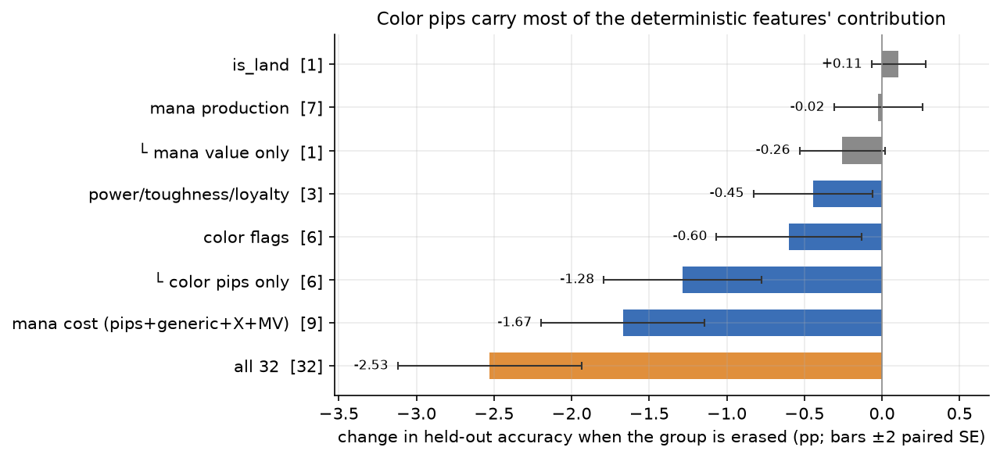
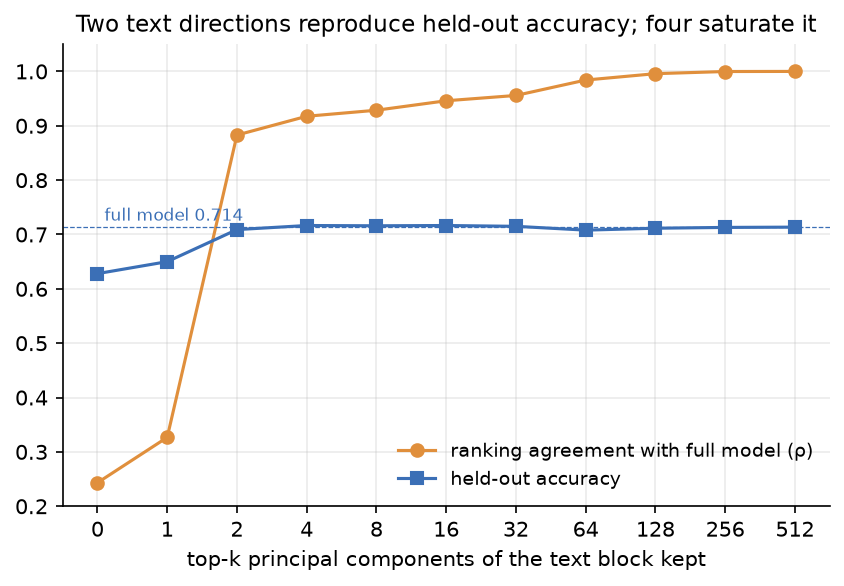
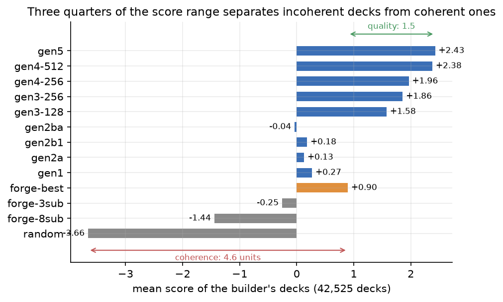
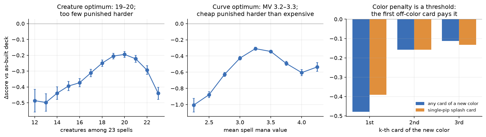
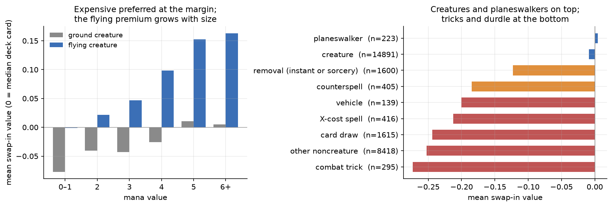
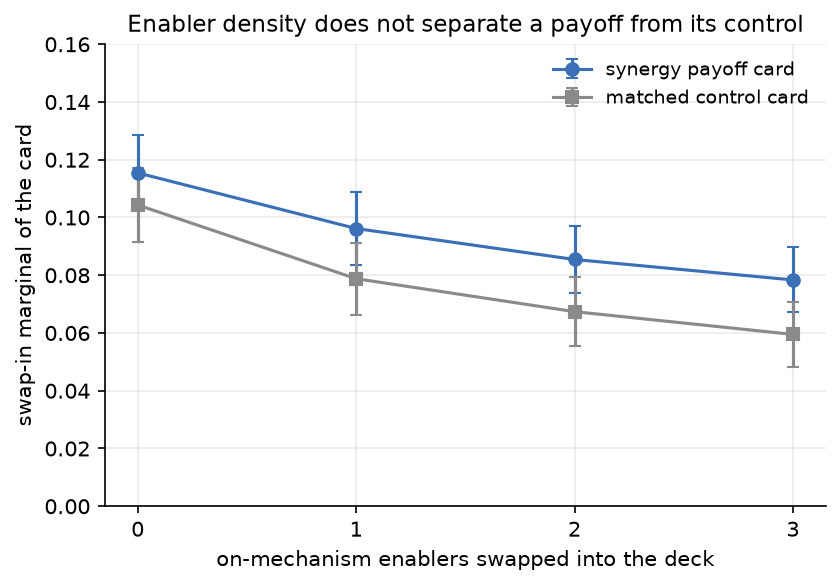

# What the deck scorer prefers

This document records an interpretability study of the production sealed deck scorer: which deck properties raise its score, which lower it, and where those preferences come from. It is the evidence base for an article on what the scorer likes and dislikes when building from a sealed or draft pool.

The method had three phases. Fifty hypotheses were brainstormed and critiqued by four independent Opus reviewers, one of which ran label-level regressions against Forge's bundled human draft rankings. The surviving hypotheses were ranked. A battery of inference-only probes then tested them: roughly half a million scorer forward passes, no training. Every probe lives in [`scripts/scorer_probes/`](../scripts/scorer_probes/README.md); each figure and table below names its script, and the numbers regenerate from the staged outputs in `output/scorer-probes/`.

The subject is the gen-4 production checkpoint `models/sealed/scorer/512-best_l6_h4_s4_ff2176_mlp512_lr1e-05_mwlog.pt`. Its input is one 544-wide vector per card: 512 dims from the sealed text encoder and 32 deterministic features. Its body is a 6-layer Set Transformer with 4-seed attention pooling. It was trained 2026-05-18 on 70,134 Bo7 Forge-AI self-play matches with log margin weighting. Background: [`2026-05-15-gen4-initial-training.md`](2026-05-15-gen4-initial-training.md), [`specs/2026-05-03-card-winnability-pretraining.md`](../specs/2026-05-03-card-winnability-pretraining.md), [`specs/2026-03-28-sealed-deck-picker.md`](../specs/2026-03-28-sealed-deck-picker.md).

A probe outside the scorer's training distribution measures the network's arithmetic, not a preference. The scorer only ever saw realistic decks: Forge-built, scorer-built, and versions of those with cards replaced at random, always from realistic pools. A real deck with a few cards swapped stays inside that world. A deck of 23 copies of one card does not, and every such probe below is labeled a mechanism demonstration.

## The ruler: one score unit is worth about 18 winrate points

Score differences convert to win probability at a stable rate, measured on matches the scorer never trained on. The yardstick is 4,708 Bo7 matches: gen5-, gen4-, and Forge-built decks playing each other on same-set pools, Forge AI piloting, recorded in `match-outcomes-gen5-vs-gen4-forge.txt` eight days after the training cutoff. Every "held-out" number in this document is measured on these matches, unless the probe names a wider pool.

Binning them by score margin gives a monotone calibration across all ten deciles, and the fitted curve is in the figure. Its slope sits below 1.0, so the model's own training objective, `sigmoid(Δscore)`, is mildly overconfident.

*Source: `t7_artifacts.py`, probe C.*

Two comparisons recur through the document. Held-out accuracy compares the scorer to the reality of played matches: the share of held-out matches in which the actual winner receives the higher score. Ranking agreement compares the scorer to another version of itself: both versions score the same pile of decks, and Spearman ρ measures how similar the two resulting orderings are, 1.0 for the identical order and 0 for an unrelated one. Played matches play no part in ranking agreement. In the ablations below, the other version is always the same checkpoint with part of its card input erased, judged against the full model.

Held-out accuracy for the full model is 71.9%, at the Bo7 oracle ceiling of 0.72–0.78 estimated in [`2026-04-26-gen2-initial-training.md`](2026-04-26-gen2-initial-training.md). Accuracy per matchup runs from ~99% on gen-vs-random pairs down to ~60% on gen4-vs-gen5 and mirror pairs. Every Δscore below converts at roughly 18 winrate points per unit.

## The scorer is a mean pool over a 2–4 number summary of each card

### The pooling layer is a plain average, not learned attention

The scorer's learned pooling seeds attend uniformly. Measured over 400 real decks, every seed and head spreads its attention within 0.6% of exactly uniform, and no seed specializes on lands or any card class. The deck vector is therefore the arithmetic mean of the card representations.

Three invariances confirm the mean-pooling reading directly:

| test | result |
|---|---|
| replicate the deck (every card ×2, ×3) | score changes by 0.0000 |
| k identical copies of one card, k = 1…23 | score constant in k (mechanism demonstration) |
| scale the pooled representation ×0.25 … ×4 | scores unchanged (ρ = 1.0000); LayerNorm strips magnitude |

*Source: `t6_mechanism.py`, probes P2–P4.*

The consequence is that the model reads proportions, never counts. Creature share, color mix, and average card quality are visible to it; "how many cards" is not, except through the fixed deck sizes of its training data.

Inside the stack, card representations converge layer by layer: mean pairwise cosine rises from 0.19 at the input to 0.73 after layer 6. This over-smoothing is why multi-view pooling and hand-computed deck stats added nothing in the gen-2 sweeps ([`2026-04-26-gen2-initial-training.md`](2026-04-26-gen2-initial-training.md)): the architecture was already computing deck-level averages, and only deck-level averages.

Uniform attention is better explained by the task than by a failed optimization. Three measurements support this reading. When the gen-2 sweep added explicit max-pool and mean-pool readouts alongside the learned pooling, validation accuracy did not change, so a non-uniform readout was available and carried no extra signal. The scorer reaches the Bo7 oracle ceiling with uniform attention, so a sharper mechanism had no headroom left. The quantities that predict a Bo7 outcome in this corpus are proportions: mean card winnability, creature share, color mix, curve mean. A uniform average is the correct operator for a proportion, not a degenerate one.

A training-side contribution cannot be ruled out, because three properties of the setup favor uniform attention from the start. The pooling seeds initialize near zero, so attention is uniform at the first step. The over-smoothed card representations give the pooling layer near-identical keys, so the gradient toward sharper attention is near zero whatever the queries learn. Bo7 label noise makes any small benefit of selective pooling hard to detect. Two discriminating experiments are cheap and have not been run: training an otherwise-identical scorer with a fixed mean in place of the pooling layer, and running the same attention capture on the gen-1 through gen-3 checkpoints.

Selective attention would matter only where deck value depends on extremes or pairings: a single bomb, a single unplayable card, a hole in the curve, a synergy pair. The corpus removes those signals before the scorer sees them. Bo7 aggregation averages out single-card extremes, and the Forge AI neither builds around nor pilots synergies. Attention still does necessary work in this model: the uniform mixing in the self-attention stack carries the deck context that the off-color penalty and splash thresholds below depend on. What never differentiated is selective attention, because a uniform broadcast was all the task required.

### The card-text embedding carries the signal; the 32 deterministic features are nearly redundant

Erasing per-card text costs nine points of held-out accuracy. Erasing the 32 deterministic features costs two. Each ablation replaces one block of every card's vector with its corpus mean and rescores all 4,708 held-out matches.

*Source: `t5_ablation.py`.*

The ablation reverses the gen-2-era diagnosis. [`2026-05-02-deterministic-feature-reliance.md`](2026-05-02-deterministic-feature-reliance.md) hypothesized the scorer leaned almost entirely on the deterministic features, and its planned ablations were never run. On gen-4 the text embedding is the primary channel. Ranking agreement shows the same asymmetry. Erasing text scrambles the model's deck ordering (ρ 0.51 against the full model); erasing the deterministic features leaves it largely intact (ρ 0.85). The two metrics can come apart, because an edit can reorder decks that sit close together in quality without flipping any pair a match actually compares.

Inside the deterministic features, the color pips are the one group the scorer clearly needs. The probe erases one feature group at a time, with the same mean-substitution design as the block-level ablation above. Two changes make the small per-group effects resolvable. The evaluation pool widens to 21,564 held-out matches, because the gen-4 round-robin corpus was generated 2026-05-19 through 2026-05-21, after the training cutoff, and joins the gen-5 file. Significance comes from the paired per-match difference against the full model, whose standard error is set by the prediction flip rate rather than the base accuracy.

*Source: `t5b_det_groups.py`.*

Erasing the six pip counts flips 14% of match predictions, the largest effect of any single group. The full mana-cost group accounts for two thirds of what all 32 features contribute. The color flags and the power/toughness/loyalty slots have small effects, distinguishable from zero (z ≈ −2.5 each). Mana value alone is marginal. Mana production and is_land contribute nothing, because the text embedding already knows what a card produces and whether it is a land. The single-group effects sum to approximately the all-32 effect, so the contribution decomposes additively across the groups, with nothing left to interactions.

Which card carries which text vector barely matters. Permuting the text blocks across a deck's cards, keeping the bag of vectors intact, costs under half an accuracy point. The scorer scores the bag, not the binding. Any preference that requires knowing that this body carries that ability cannot survive this test.

Telling a Forge deck from a scorer-built deck is entirely a text-embedding judgment. With text erased, forge-vs-gen pairs drop to coin-flip accuracy while every other pair type degrades far less.

The same dependency explains the generation history: the aggregation barely changed from gen-2 to gen-4, and the gains came from the inputs. Gen-2's text dims came from the price-predictor encoder, whose training signal is card prices, a quantity dominated by collector value. Vectors like that carry no sealed card quality, so a mean over them can express deck shape and nothing else. The consequence was measured at the time: at matched deck shape, forge-best beat gen-2 by 8–17 winrate points ([`2026-05-02-deterministic-feature-reliance.md`](2026-05-02-deterministic-feature-reliance.md)). Gen-2's four null aggregation experiments — depth, dropout, multi-view pooling, hand-computed deck stats — all located the bottleneck upstream of the pooling.

Replacing the encoder is what moved match play. Gen-3 swapped the price encoder for one trained from scratch on per-card winnability labels, distilled from about a million self-play games. The swap took gen-3 from losing the matched-shape comparisons to beating forge-best on 47 of 48 pools ([`2026-05-13-gen3-initial-training.md`](2026-05-13-gen3-initial-training.md)). Gen-4 widened the encoder from 256 to 512 dims, worth ~3.3σ over the 256-wide build in match play ([`2026-05-15-gen4-initial-training.md`](2026-05-15-gen4-initial-training.md)).

The form of supervision mattered as much as the encoder. Phase B in the gen-2 era fine-tuned the price encoder against match outcomes and did not improve on the frozen baseline ([`2026-04-30-gen2-unfrozen-embeddings.md`](2026-04-30-gen2-unfrozen-embeddings.md)); a Bo7 match outcome is one noisy bit, too little signal to teach per-card quality through the scorer. Dense per-card labels from game logs are what succeeded. Across the whole lineage, the scorer was always a mean over per-card summaries, and every real gain came from improving what those summaries contain.

### Two numbers per card explain almost everything the scorer reads from text

Keeping only the top two principal components of every card's text vector reproduces the scorer's held-out accuracy. Four components saturate it. Ranking agreement with the full model keeps improving out to 256 components, so the remaining directions still shift scores; they just stop changing which deck of a held-out pair ranks higher.

*Source: `make_text_pca.py` for the PCA; `t6_mechanism.py`, probe P1, for the truncation.*

The encoder's card cloud is this compressible because it is low-rank to begin with: PC1 carries 55% of card-to-card variance, the top 8 carry 75%, and the participation ratio is 3.2. The gen-3 encoders measured the same way in [`2026-05-11-sealed-encoder-hparam-sweep.md`](2026-05-11-sealed-encoder-hparam-sweep.md) had the same shape.

Each card therefore reaches the scorer as a 2–4 number summary: roughly a winnability scalar, a castability axis, and color affinity. The deck score is a shape-aware average of those summaries.

### Three quarters of the score range separates incoherent decks from coherent ones

Of the 6.1 score units between the mean random-pile deck and the mean gen-5 deck, 4.6 lie below the forge-best baseline. Realistic candidate decks for one pool live on the remaining quarter of the range. Within that quarter the ordering is right: mean score by builder is strictly monotone in the builders' real match-play strength.

*Source: `t0_landscape.py`; cuts in `post_hoc_slices.py`, section `t0`.*

## Shape: it wants 19 creatures, two or three colors, a 3.2 curve, and 18 lands

Shape probes swap cards inside real decks and read the score response. Contexts are 250–800 decks sampled from 10,000 aligned pool/deck pairs. One baseline number recurs: swapping any chosen card for a card the builder rejected costs about −0.40, because chosen cards are simply better. Ladder effects are read against that baseline and against each ladder's own rung-to-rung marginals.

*Source: `t3_ladders.py`; the spell-count probe is `t7_artifacts.py` B, the add-a-card probe `t1_meansum.py`.*

### Color count: the price is paid per color, and the first off-color card pays it

The first card of a new color costs three to four times what every further card of that color costs. The first card's marginal is −0.48; the second and later cost ordinary swap prices near −0.13 (right panel above). The single-pip splash ladder shows the same threshold. The scorer prices the presence of a third color, not the number of off-color pips. That is the economics of a manabase that must find slots for every color it plays.

Color fixing is priced too, at about a tenth of the splash cost. In a 2×2 probe (splash spell, on-color dual land, both, neither) the dual offsets the splash penalty by +0.04 (t = 14): real color-fixing logic, small magnitude.

The deployed builds show the preference. gen4-512 builds 2 colors 34% of the time and 3 colors 58%, and it adapts to set structure: 2.2 mean colors on artifact-heavy Mirrodin sets, 4.0 on all-gold Alara Reborn (`post_hoc_slices.py`, section `decks`).

### Creature count: the optimum is 19–20, and too few is punished harder than too many

The creature ladder is an inverted U with its peak at 19–20 creatures out of 23 spells (left panel above). Removing four creatures costs −0.69; adding four costs −0.54. The optimum sits above Forge's own ~14.6 creatures and above even gen-4's built average of 18.2.

The asymmetry matches the training corpus, where creature-light decks lose badly under Forge piloting. Whether it matches human play is a question the corpus cannot answer; [`2026-05-13-gen3-initial-training.md`](2026-05-13-gen3-initial-training.md) documents the piloting bias.

### Curve: the optimum is near mean mana value 3.2–3.3, and cheap is punished harder than expensive

The curve ladder peaks at a mean spell mana value (MV) of 3.2–3.3 (middle panel above). Four swaps toward cheaper cards cost −1.09; four toward more expensive cost −0.80. The peak sits at the bottom edge of the 3.4–4.0 band the gen-2-era win-rate tables identified as strongest, so the deck-level curve taste is roughly right with a slight cheap-side lean.

The deck-level optimum coexists with a card-level preference for expensive cards (next section). The two are consistent: a good curve needs its cheap slots filled, but an individual cheap card is rarely the best card.

### Curve shape beyond the mean does not matter

A mean-preserving spread, swapping two 3-drops for a 2-drop and a 4-drop or the reverse, moves the score less than a quality-matched control swap at the same mean (|Δ| lower by 0.07, t = 3.7). The scorer holds no opinion on curve smoothness, gaps, or bimodality at fixed mean. The "no 2-drops" alarm a human builder raises has no analogue in the model.

### The scorer wants 22 spells and 18 lands, and the deployed builder cannot give them to it

Offered the same deck at 22, 23, or 24 spells, the scorer prefers 22 in 88% of decks. The controls split the preference into a count effect and a card-quality effect:

| change to the 23-spell deck | mean Δscore | share improved |
|---|---|---|
| drop the worst-label spell → 22 spells, 18 lands | +0.08 | 89% |
| drop a random spell → 22 spells (count-only control) | −0.00 | 53% |
| add the best-label unused spell → 24 spells | −0.46 | 4% |
| add a random spell → 24 spells (count-only control) | −0.44 | 1% |

*Source: `t7_artifacts.py`, probe B; 800 aligned pool/deck pairs.*

Going down to 22 spells is a pure quality gain: the count change itself is neutral, and dropping the worst card is an improvement on its own. Going up to 24 is a hard count penalty that the card's quality barely moderates, because spell counts above 23 never occur in the training data. The preference is not curve-conditional (correlation with deck mean MV: 0.01).

The deployment mismatch is direct. `GreedyDeckBuilder` pins 23 spells by construction, so the scorer's 18-land opinion is unexpressible at build time.

The same size prior governs nonbasic lands, with land classes correctly ordered inside it:

| card added to a built deck | mean Δscore | share positive |
|---|---|---|
| land producing the deck's colors | −0.07 | 19% |
| off-color land | −0.12 | 7% |
| colorless-producing land | −0.12 | 4% |
| on-color spell | −0.22 | 2.5% |
| off-color spell | −0.52 | 0.4% |

*Source: `t1_meansum.py`, 400 contexts; on/off-color split in `post_hoc_slices.py`, section `t1color`.*

Lands are the least-refused addition, and on-color duals the least-refused lands, but most land adds still read as negative. That is why scorer-built decks carry 0.5 nonbasic lands on average where Forge's carry 1.1, and why 62% of gen4-512 decks run zero. The builder under-plays duals as a direct result: its 23-spell invariant forbids trading a spell for a land, and adding the land on top usually reads as dilution.

## Cards: winnability first, creatures over removal over durdle

Card-level values come from two probes that agree with each other (r = 0.78). The first is leave-one-out deltas inside 3,500 real decks. The second is a standardized swap-in value, `v_swap`: put the card into the median slot of up to eight fixed two-color Forge-built decks matching its colors. `v_swap` was measured for all 26,402 cards with 30+ game observations; it is on the same score scale as everything else, and 0 means "as good as the median card of a real deck".

*Source: `t2_marginal_values.py`; analysis in `t2_analyze.py`.*

### The card ranking is learned winnability first

The scorer's per-card value tracks the encoder's empirical win-rate labels more strongly than any visible card property: Spearman 0.68 against `shrunk_score_play`. A regression on visible properties (type, cost, stats, keywords, rarity) explains 40% of the value variance; adding the empirical label lifts it to 58% and dwarfs every other coefficient. Before anything else, the scorer reads "this card won games in the self-play corpus". The deck-shape terms above are layered on top.

### The category order is creatures, then removal, then everything else, not BREAD's

An average creature outranks an average removal spell by about a tenth of a unit, and removal outranks the rest of the noncreature pile by a further tenth:

| category | n | mean v_swap |
|---|---|---|
| creature | 14,891 | −0.01 |
| noncreature removal | 1,600 | −0.12 |
| card draw | 1,493 | −0.25 |
| other noncreature | 8,418 | −0.25 |

*Source: `t2_analyze.py`, section 3.*

The scorer demotes removal below generic bodies, where the human BREAD ordering puts Removal second only to Bombs. The label-level comparison against Forge's shipped human pick orders (`human_rank_probe.py`) locates the divergence, in units of the label's card-to-card spread: removal sits 0.2 below where humans rank it, card draw 0.45 below, artifacts 0.63 below, while flying creatures sit 0.57 above.

The mechanism is the Forge-AI meta the labels were earned in. The AI attacks and blocks competently but times instants and card advantage poorly, so bodies convert to wins and answers convert to card disadvantage. Instant-speed removal earns no premium over sorcery-speed (−0.10 both).

The extremes of the card ranking tell the same story. The bottom is uniformly durdle artifacts and engines: Cloudstone Curio, Witch's Oven, Krark's Thumb. The top is 26 creatures out of 30 cards, mostly 4–6 MV flying and lifelink rares.

### Expensive cards are preferred at the margin, and the flying premium grows with size

Marginal value rises monotonically with mana value, from −0.19 for 0–1 MV cards to −0.01 for 6+ MV. A flier outscores a ground creature of the same MV bucket everywhere, and the gap grows from +0.06 at low cost to +0.16 at the top end.

*Source: `t2_marginal_values.py` data; figure by `make_figures.py`. Classes in the right panel overlap where a card qualifies for more than one.*

Cheapness is not a per-card virtue anywhere in the model. Castability is priced at the deck level, through the splash thresholds and pip support above. The labels agree: `score_play` rises with MV while `played_rate` falls, and the scorer follows the winnability axis.

Statline composition matters more than efficiency. Conditioned on MV and total stats, the label regression (`label_probe.py`) prices +1 power at +0.004 and +1 toughness at −0.002. Stats-per-mana carries almost no signal (correlation with v_swap: 0.04). Creatures with a combat keyword average +0.08 over keyword-less ones; vanilla creatures score the same as creatures whose text has no combat keyword.

### Only mythics carry a rarity premium, and rarity is inferred from text alone

Commons, uncommons, and rares all average the same value (−0.11 to −0.12); mythics average +0.01. The encoder receives no rarity input, so the premium is whatever bomb-ness the text itself reveals. Controlling for the empirical label flips the rare coefficient negative: the average rare's text reads worse than its label warrants, consistent with sealed rares including many narrow or constructed-facing cards.

### Class by class: tricks at the bottom, planeswalkers priced like creatures

The right panel of the figure above ranks the classes; the exact values (`post_hoc_slices.py`, section `t2class`):

| class | n | mean v_swap | note |
|---|---|---|---|
| combat trick (pump instant) | 295 | −0.27 | worst class measured |
| X-cost spell | 416 | −0.21 | X encodes as 0 MV, so these read as bad cheap spells |
| vehicle | 139 | −0.20 | not fooled by the printed P/T in the deterministic features |
| counterspell | 405 | −0.19 | |
| hybrid-mana card | 545 | −0.16 | low-MV confounded |
| noncreature token-maker | 1,206 | −0.12 | |
| removal, instant or sorcery | 1,100 | −0.10 | excludes artifact/enchantment removal, which drags the category table's broader removal mean to −0.12 |
| planeswalker | 223 | +0.00 | at parity with MV-matched creatures |

Two rows contradict the hypotheses that motivated them. Combat tricks were predicted to be overvalued: their `cast_lift` label is the highest of any class. That label is a survivorship artifact, because a cheap card goes uncast only in games that were already lost. The scorer ranks tricks lowest anyway; the cheap-instant penalties dominate, and it lands near the human consensus on tricks by a different route. Planeswalkers were predicted to be depressed by the AI's poor piloting; they price at creature parity instead.

Two hypothesized artifacts have no measurable effect. Vehicles carry a printed P/T in the deterministic features despite doing nothing uncrewed, yet they price low: the text-embedding labels carry the truth. A wordiness bias (long text as a power proxy) measures at a standardized +0.003, effectively zero.

## Synergy is absent; only density effects survive

### Pair synergy is absent: enabler density does not raise a payoff's value

The scorer does not pay more for a synergy payoff as its enablers enter the deck. The probe used 57 curated payoff/enabler/control triples spanning tribal lords, sacrifice payoffs, heroic targets, devotion, and spells-matter, from 20 sets, commons and uncommons only. Every control matches its payoff on set, color, broad type, and mana value within 1. For each triple and eight real same-set decks, filler slots were swapped for 0–3 enablers, and the payoff's swap-in marginal was measured at each dose against the control's.

*Source: `t4_synergy.py`, probe P-A; dataset `synergy_pairs.json`.*

| statistic (mean over 57 entries) | value |
|---|---|
| Δdose = (payoff − control) gain from 0 → 3 enablers | +0.008 ± 0.010 (p = 0.43) |
| same, with mismatched enablers (another mechanism, same set) | +0.002 ± 0.009 |
| matched − mismatched, paired | +0.006 ± 0.010 (p = 0.55) |
| payoff standalone gap vs control at dose 0 | +0.011 ± 0.021 |

Both the aggregate and the leakage control are null. Three on-mechanism enablers buy a payoff about a tenth of a winrate point over its control, indistinguishable from what off-mechanism cards of the same set buy. The mechanism results predicted this: a model that does not track which card carries which text has no substrate for card-pair reasoning. What the scorer calls synergy is what the encoder labels carry: per-card color affinity and the deck-shape terms.

The apparent exceptions mostly dissolve under the mismatched-arm control. Gray Merchant of Asphodel posts the largest matched Δdose (+0.42), but its mismatched arm posts +0.36: any decent same-set cards raise its marginal, which is deck drift, not devotion. One entry survives the control, Wingsteed Rider (matched +0.19, mismatched −0.15). Heroic's value is literally the density of spells that can target it, the kind of statistical property a bag-of-cards average can carry.

### Duplicates are priced like distinct cards of the same quality

The second and third copy of a card are worth what the first is worth. The probe replaces k filler slots with k copies of a decent creature, and separately with k distinct cards matched on single-swap marginal. The copies come out ahead by +0.01 to +0.02 per rung, a statistically significant bonus worth under one winrate point over three swaps, and there is no diminishing-returns penalty. Both arms' marginals shrink together as k rises, which is the mean-pooling dilution at work, not a duplicate effect.

*Source: `t4_synergy.py`, probe P-B.*

### The removal-share opinion is weak: cutting below three hurts a little, stacking is free

Stripping two removal spells from an average deck costs −0.07 net of matched control swaps. Adding one to three more costs nothing. Across base removal counts from 2 to 8 the net deltas stay within ±0.16 with no consistent interior optimum. The scorer holds creature count and curve strongly, and removal share barely at all. That is consistent with the card-level finding: removal is priced like a slightly-below-average body, not a scarce role to fill.

*Source: `t4_synergy.py`, probe P-C.*

## The taste is the Forge-AI meta plus inherited human annotations

### The meta is Forge-AI self-play, and its piloting asymmetries are the largest single influence

Every preference above is a preference over decks as piloted by Forge's AI in Bo7 self-play. The AI's strengths and weaknesses explain the card-level profile: it handles combat math well and aerial defense badly, so bodies and fliers convert to wins; it times instants and card advantage poorly, so answers and draw do not. [`2026-05-13-gen3-initial-training.md`](2026-05-13-gen3-initial-training.md) established the asymmetry; every card-level probe here is consistent with it. The scorer optimizes the right objective for its deployment target and a measurably different objective from human Magic.

### Part of the card ranking is inherited human taste, and part of the blacklist is inherited too

Forge's own builder picks by a bundled human pick-order file, and 40% of the original training decks were built that way. The labels therefore partially encode human taste rather than independently rediscovering it: human draft rank correlates with `shrunk_score_play` at Spearman 0.45.

Forge's hand-written `AI:RemoveDeck` blacklist (4.7K cards its builder refuses to play) leaves a direct corpus footprint. Blacklisted cards show a played-rate label 0.15 below matched controls, against a quality-label difference of only −0.03. The scorer's dislike of those cards is annotation inheritance, not game evidence.

*Source: `forge_hints.py` extraction; joins in `t7_artifacts.py`, probe D2.*

### Scores are only comparable within a set

Training pairs are always same-set, so the Bradley-Terry graph is disconnected across sets and per-set score offsets are unidentified. The offsets are large: Forge-built decks average −0.97 on Dissension and +2.13 on Double Masters, a spread of 3.1 units against a within-set deck spread of 0.93. Simple creature-dense sets land high; gold-heavy sets land low. A cross-set score comparison mixes set identity into deck quality roughly 3:1 and should never be used.

*Source: `post_hoc_slices.py`, section `t0`.*

### The builder-family signature adds little once quality and shape are controlled

Builder families are trivially separable in the corpus: every Forge deck has 22 spells, every learned-builder deck exactly 23, and shape alone identifies the family at AUC 0.91. A scorer could in principle score that fingerprint instead of the deck. The measured residual is modest. After controlling mean card quality plus creature count and color count, the score's partial correlation with the shape fingerprint is 0.11. Most of the preference for gen-family decks routes through card quality and the shape preferences above, which are themselves win-correlated.

*Source: `t7_artifacts.py`, probe A.*

### Single-swap decisions are partly checkpoint noise

Three sibling gen-4 checkpoints agree on whole-deck ranking (Spearman 0.86–0.92) and on the direction of a swap (96–98%). They pick the same best swap out of twenty candidates only 48–66% of the time. The greedy builder's exact top choice is therefore partly model noise, even where the ranking it climbs is stable. Per-set held-out accuracy spread is likewise dominated by sampling noise (sd 0.087 observed vs 0.077 binomial): no robust per-set blind spot at ~30 matches per set.

*Source: `t7_artifacts.py`, probes D1 and C.*

### Encoding faults exist and mostly wash out

Three input-encoding faults were verified in code and then measured. X costs contribute zero to the mana-value feature, so Fireball-likes read as ~1-drops; their class value is low (−0.21), plausibly double-punished as bad cheap spells. Hybrid pips are counted for both colors, overstating the cost constraint; hybrid cards measure −0.16 with the low-MV confound and no clean isolation. Phantom P/T on vehicles and zero P/T on token-makers do not mislead, because the text-embedding labels dominate. Multi-face cards, whose deterministic features come from the front face only, show no measurable valuation distortion (n = 71 on-color adds: −0.16 vs −0.22 for single-face). No scorer-built deck contains snow basics or Wastes (0 of 10,000).

*Source: `post_hoc_slices.py`, sections `t2class`, `t1color`, `decks`.*

## Hypothesis verdicts

The fifty ranked hypotheses, with verdicts. "Confirmed" and "falsified" mean the probe result matched or contradicted the hypothesis as sharpened after critique; "partial" means the mechanism held with a materially different magnitude or route. Evidence pointers name the probes of the inventory below.

| # | hypothesis (short) | verdict | evidence |
|---|---|---|---|
| R1 | score ≈ text-carried per-card quality sum; det features minor | confirmed | T5 ablation; T2 correlations; T6 PC-truncation |
| R2 | 2–3 colors preferred; 4–5 penalized; castability-floor mechanism | confirmed | T3-A/E/F ladders |
| R3 | creature-dense optimum (~17–18) | confirmed, optimum higher (19–20) | T3-B |
| R4 | flying premium above human norm | confirmed | T2 flags; label E5 |
| R5 | scores set-relative, cross-set incomparable | confirmed | T0 set offsets |
| R6 | board-centric midrange, big-over-cheap, not aggro | confirmed | T2 MV/category; T3-C |
| R7 | mean-like pooling; below-average additions lower score | confirmed (mechanism exact) | T6 P2/P4 |
| R8 | scorer under-plays nonbasic lands vs Forge | confirmed | T0 counts; T1 land adds |
| R9 | counterspells undervalued | confirmed | T2 class slice |
| R10 | card-draw/durdle penalized; lifegain/scry neutral | confirmed | T2 categories; labels E1/E5 |
| R11 | removal priced at/below median creature | confirmed | T2 category means |
| R12 | size over efficiency; stats-per-mana unrewarded | confirmed | T2 ((P+T)/MV corr ≈ 0.04) |
| R13 | power > toughness at fixed stats | confirmed (label level) | E1 regression |
| R14 | creature bombs ≥ human, noncreature bombs ≪ human | partial — top-30 all creatures; planeswalkers at parity | T2 extremes, class slice |
| R15 | rarity gradient without rarity input | confirmed, mythics only | T2 rarity means |
| R16 | keyword story ≈ flying + small rest | confirmed | T2 per-keyword |
| R17 | 6+MV marginal declines with count | untested as stated; deck-level curve optimum confirms diminishing top-end | T3-C |
| R18 | score-optimal curve ≤ win-optimal band | confirmed (3.2–3.3 vs 3.4–4.0) | T3-C |
| R19 | on-color castability priced; cheapness not a per-card bonus | confirmed | T1 on/off-color; T2 MV |
| R20 | on-color gold ≥ mono | supported (n_colors +0.25 std in context-matched swaps) | T2 model A |
| R21 | artifacts penalized, not bonused | confirmed | T2 categories; bottom-30 |
| R22 | single-swap resolution near noise | partial — top-1 noisy, ranking stable | T7-D1 |
| R23 | builder-fingerprint detection | partial — 0.11 residual after controls | T7-A |
| R24 | vehicles overrated by phantom P/T | falsified — priced low | T2 class slice |
| R25 | X/hybrid encoding faults distort | confirmed for X (direction: undervalue); hybrid unresolved | T2 class slice |
| R26 | systematic per-set blind spots | not detectable at n≈30/set | T7-C |
| R27 | human-taste inheritance | confirmed (ρ 0.45) | T7-D2 |
| R28 | wordiness bias | falsified (β +0.003) | T2 post-hoc |
| R29 | AI:RemoveDeck blacklist inheritance | confirmed via played_rate | T7-D2 |
| R30 | tricks overvalued (label artifact) | falsified — scorer ranks tricks lowest | T2 class slice |
| R31 | pair-synergy detection | falsified (Δdose +0.008, p=0.43); one entry (Wingsteed Rider, heroic) survives the mismatched-arm control | T4 P-A |
| R32 | set-archetype awareness beyond shape | no evidence — matched vs mismatched enablers indistinguishable | T4 P-A control |
| R33 | duplicate penalty/bonus | falsified — copies priced like matched distinct cards | T4 P-B; T6 P4 |
| R34 | role-balance concavity (removal share) | weak — small cost below ~3 removal, stacking free | T4 P-C |
| R35 | curve-dispersion preference at fixed mean | falsified | T3-D |
| R36 | splash penalty per-color threshold | confirmed | T3-E |
| R37 | fixing×splash interaction | confirmed, ~10% offset | T3-F |
| R38 | land classes priced (dual > utility > off-color) | confirmed | T1 land subset |
| R39 | consistency (played_rate at fixed quality) | weakly supported — played_rate correlates (+0.47 raw); partial effect untested | T2 correlations |
| R40 | flat swap-sensitivity across slots (no replacement-level concept) | untested | — |
| R41 | narrow cards penalized via score not played_rate | untested (no tag built) | — |
| R42 | dynamic range spent on coherence | confirmed (75%) | T0 |
| R43 | mode-seeking miscalibration OOD | reframed: OOD scores arbitrary, per training-envelope scope rule | T6 P5 |
| R44 | det-feature reliance (gen-2 hypothesis) | falsified for gen-4 — text dominates | T5 |
| R45 | multi-face mis-encoding distorts value | mechanism real, effect not measurable | T1 slice |
| R46 | mean-not-sum pooling | confirmed | T6 |
| R47 | OOD degeneracy | confirmed as mechanism demo only | T6 P5 |
| R48 | deck-size gradient | confirmed — anti-24th-card prior, pro-22-spell | T7-B; T1 |
| R49 | high-n card memorization | untested (cost) | — |
| R50 | snow-basics quirk | absent from builds | T0 check |

## Probe inventory

| probe | script (`scripts/scorer_probes/`) | what it did | scale |
|---|---|---|---|
| T0 landscape | `t0_landscape.py` | scored every builder's decks from the match corpora, joined deck features | 42,525 decks |
| T5 ablation | `t5_ablation.py` | block-ablated rescoring of all held-out matches | 8,658 decks × 5 conditions |
| T5b det groups | `t5b_det_groups.py` | per-group ablation of the 32 deterministic features, paired per-match statistics | 21,564 matches × 9 conditions |
| T1 add-a-card | `t1_meansum.py` | scored every remaining pool card added to built decks | 400 contexts, 16K forwards |
| T2 marginal values | `t2_marginal_values.py`, `t2_analyze.py` | leave-one-out + fixed-context swap-in value for every observed card | 26,402 cards, ~235K forwards |
| T3 ladders | `t3_ladders.py` | six controlled swap ladders (color, creature, curve, spread, splash, fixing) | 250 contexts, 7,127 decks |
| T6 mechanism | `t6_mechanism.py` (+ `make_text_pca.py`) | PC-truncation, attention/over-smoothing capture, invariance checks, OOD envelope | 400 decks + 2,000 matches × 11 truncations |
| T7 artifacts | `t7_artifacts.py` (+ `forge_hints.py`) | builder fingerprint, spell-count preference, calibration, sibling agreement, Forge-annotation joins | 800 pairs + 4,708 matches + 6,300 decks × 3 checkpoints |
| T4 synergy | `t4_synergy.py` (+ `synergy_pairs.json`, `verify.py`) | dose-response super-additivity (57 curated triples × 8 contexts, matched + mismatched arms), duplicates ladder, removal-share ladder | 9,397 decks |

The scripts live in [`scripts/scorer_probes/`](../scripts/scorer_probes/README.md); its README carries the run order and the full script-to-section map. Their outputs are kept in `output/scorer-probes/` and regenerate on rerun; they are the `t*_report.md`, `t*_results.json`, and CSV files this document's numbers come from. The figures regenerate with `make_figures.py`. Prose numbers with no dedicated probe script come from `post_hoc_slices.py`. The label-level numbers ("sd vs human pick order", the power/toughness and rarity regressions) come from `label_probe.py`, whose joined table feeds `human_rank_probe.py` and `rarity_probe.py`. Every probe is inference-only against the production checkpoint plus the `cardsfolder-512` embedding cache, the Y: corpus files, and `cards-win-rates.txt`.

Limitations. Card-level values are context-relative: `v_swap` comes from two-color Forge-built contexts, so a card's value in an archetype the corpus never builds is not measured. Shape ladders perturb decks built by a sibling scorer, so rung 0 sits at a local optimum and raw rung deltas include a chosen-vs-rejected quality baseline. Conclusions therefore rest on rung-to-rung marginals and controls, not raw deltas. Everything is a preference of this checkpoint under Forge-AI-piloted Bo7. None of it is a claim about human Magic except where explicitly compared to human pick orders.
