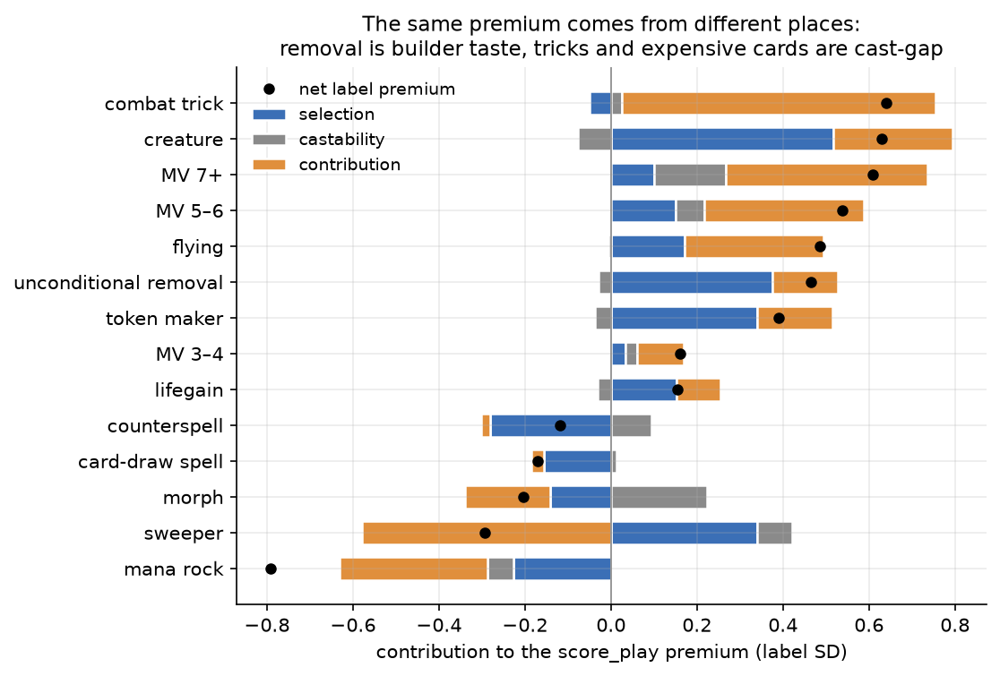
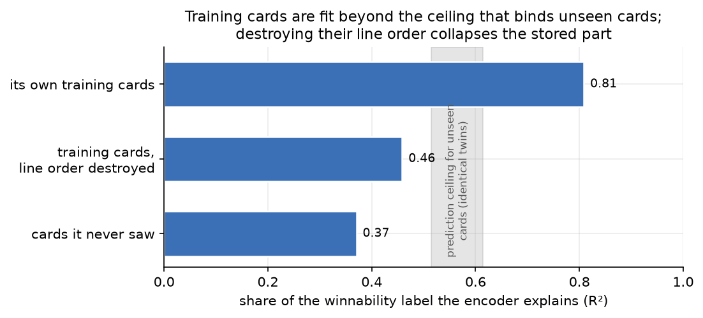
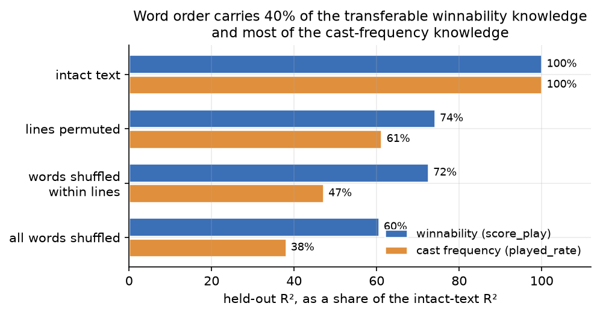
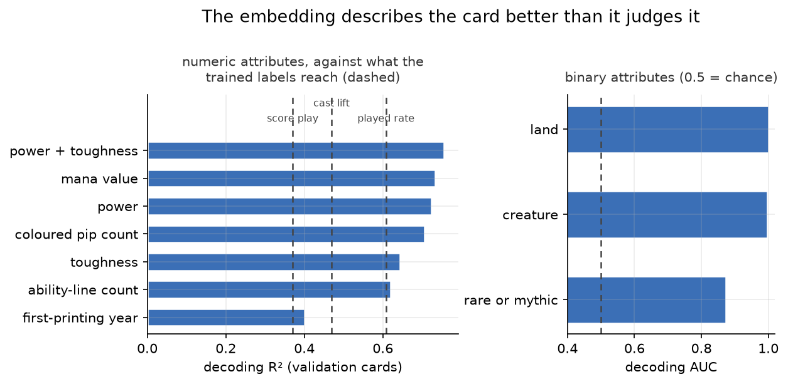
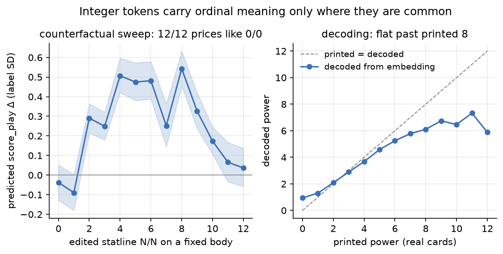
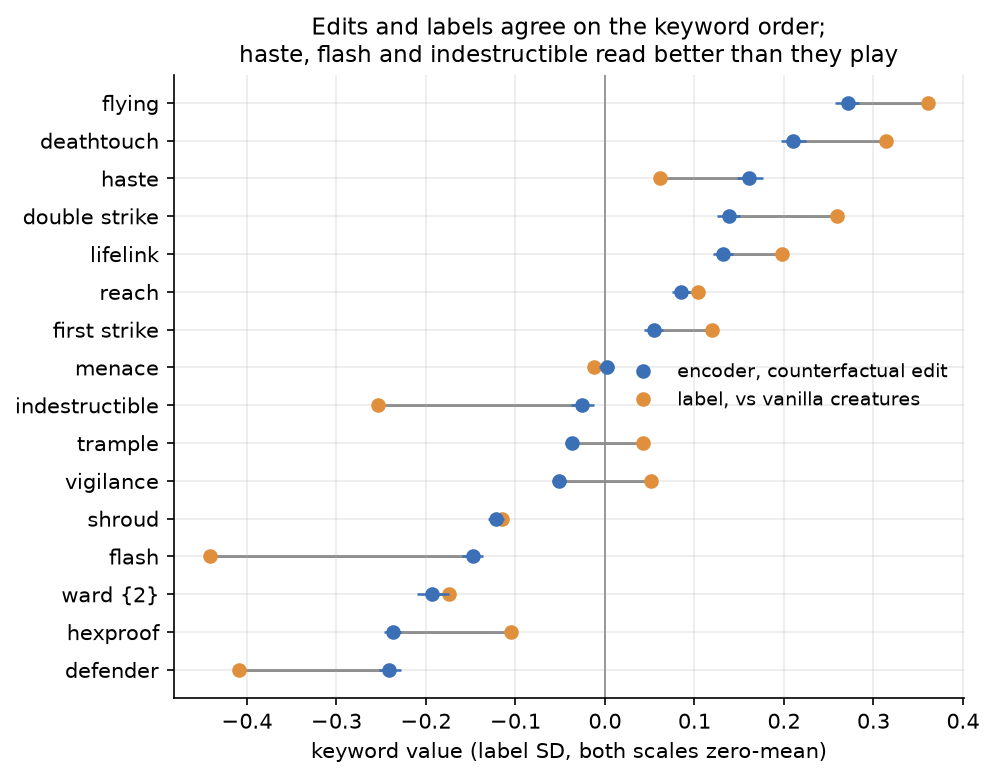
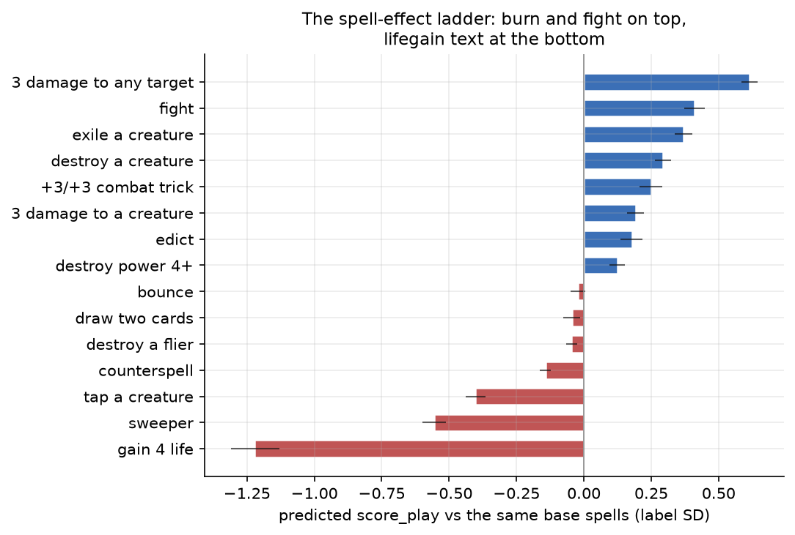

# What the card encoder reads

## The short version

- The encoder's card ratings are faithful copies of its training labels, and the labels are only partly about the card. A card's winnability label mixes three things: which deck builders were willing to play the card, how often it got cast, and whether winners cast it more than losers. Only the last part is about what the card does in a game.
- Half of what the encoder appears to know is memorized card identity. On cards it never trained on, its accuracy drops by more than half, and on trained cards it fits the labels more tightly than their own sampling noise allows. The memory key is the card's text layout, not its words.
- What generalizes is mostly a bag of words. Sixty percent of the encoder's transferable winnability knowledge survives shuffling every word in every card. A thin compositional layer sits on top: the word "flying" earns its premium only on an ability line of a creature, and inverting a pump spell's sign or restricting removal to your own creatures moves the prediction the right way, weakly.
- The best keyword in Forge's eyes is flying, worth about 0.4 label standard deviations on its own, followed by deathtouch, haste, double strike, and lifelink. Hexproof, ward, and shroud are penalized even though the labels pay for them. Deathtouch plus trample is superadditive.
- The best spell text is direct damage, then fight, exile, and destroy. Lockdown auras top all noncreature text. Sweepers, tap effects, and counterspells sit at the bottom, and a spell whose whole text is lifegain is the worst text the encoder knows.
- Bodies beat effects. The same effect is worth about 0.6 standard deviations more stapled to a creature than printed on a sorcery. A mana dork is fine and a mana rock is bad for exactly this reason.
- The encoder's loudest internal axis is not card quality but "will this card leave Forge's hand": lands and equipment at one end, morph, fogs, sweepers, and counterspells at the other. Mana cost explains only a seventh of that axis.
- The embedding describes the card better than it judges it. Mana value, power, toughness, and card type are all decodable from it more accurately than any label it was trained on, and even the card's printing era and rarity are recoverable from wording alone.
- A hand-built table of 135 nameable features matches the encoder's winnability judgment on unseen cards almost exactly. The encoder's real advantage over a spreadsheet is in predicting cast frequency, not card quality.
- Two of the label groups turned out to be artifacts: the play/draw split is nearly all sampling noise, and the color-affinity labels mostly re-encode color identity plus a shrinkage artifact that punishes good cards. The cast-lift label carries real independent signal and should stay.

## Method and subject

The subject is the gen-4 production sealed card encoder, `models/sealed/encoder/full-20260517-014759-attn-6l-8h-8q-0.1mlm-512d.pt`: d_model 512, 6 layers, 8 attention heads, an 8-query attention pool producing a 512-dim card vector, 21M parameters. It was trained 2026-05-17 from random init on nine per-card regression labels aggregated from 974,028 Bo1 Forge-AI self-play games over 27,983 cards, plus a masked-token auxiliary loss, per [`specs/2026-05-03-card-winnability-pretraining.md`](../specs/2026-05-03-card-winnability-pretraining.md). A label is a training target: a per-card statistic measured from those game logs. The nine are the card's net win influence when cast, measured once on the play and once on the draw (the winnability labels — this document quotes the on-the-play one unless it says otherwise), the fraction of in-deck games it was cast at all (the played-rate label), the win-rate gap between games where it was cast and games where it stayed in hand (the cast-lift label), and five per-color affinity scores (the color-lift labels). The encoder learns to predict all nine from the card's rules text alone. The sibling study [`2026-08-27-scorer-preferences.md`](2026-08-27-scorer-preferences.md) examined the deck scorer built on top of this encoder; it established that the scorer consumes mainly the encoder's winnability axis, secondarily its played-rate axis. This study asks what card text produces those axes.

The method had three phases. Fifty-eight hypotheses were brainstormed, critiqued by four independent Opus reviewers, one of which ran label-level regressions against the real corpus, and consolidated into eighteen ranked study questions. A probe battery then tested them: several hundred thousand encoder forward passes and label-side analyses over the full game corpus, no training. Every probe lives in [`scripts/encoder_probes/`](../scripts/encoder_probes/README.md); staged outputs are under `output/encoder-probes/`.

Three instruments recur. The saved checkpoint contains no regression heads (the small output layers that turned the card vector into each label's prediction during training), so ridge probes refit from the cached card embeddings to the shrunk labels stand in for them. A "fidelity" probe is fit on all cards and read off for predictions; an "honest" probe is fit only on the encoder's own 22,387 training cards (the seed-42 split reconstructed exactly) and used for any generalization claim. Counterfactual edits change one thing in a card's converted text, re-encode with the production checkpoint, and read the predicted-label change; the harness reproduces the cached embeddings bit-exactly. Every edit contrast is layout-matched, because line-order placebo edits alone move predictions by about 0.3 label SD. The ruler throughout is the label standard deviation: SD(shrunk_score_play) = 0.0618, SD(shrunk_played_rate) = 0.1247. Effects quoted without a unit are in score_play SDs.

## A card can earn a strong winnability label without ever changing a game

A game's win cannot be cleanly attributed to any single card, so the winnability label shares the credit for a win, and the blame for a loss, among every card the side cast. The label counts the games the card's deck won with the card cast, minus the games it lost with the card cast, over all games the card sat in a deck. A card therefore gets credit for its deck's wins whether or not it caused them.

Three simpler quantities, called channels from here on, can be measured from the same game logs, and each one holds a different kind of fact:

- selection: how often decks containing the card win. Builder choice sets this: a card only the random builder plays is observed in decks that win 26% of their games, a card forge-best favors in decks that win 60%, and a deck's win rate flows into every card it contains. Which builders play a card therefore moves its winnability label by about ±1.8 SD before the card itself does anything.
- castability: how often the card gets cast.
- contribution: how much more often the card is cast in the games its decks win than in the games they lose. This is the only channel that measures the card changing games: it is positive when winners cast the card more often than losers did.

The winnability label equals `castability × (2·selection − 1) + contribution/2` exactly. The channels are therefore not new information: they are the same number, computed in a way that keeps its ingredients apart.

The rest of the document states its findings as premiums: a feature's premium is how much it moves the winnability label, measured against cards matched on cost and type, and a negative premium is a penalty. Every premium is read through this split, because a premium carried by the selection channel is inherited builder taste and only a premium carried by the contribution channel is evidence the card changed games. The decomposition for the headline card classes:

*Source: `l_mediation.py` / `l_analyze.py`, WLS with MV and type controls, n ≥ 50 per class; rendered by `make_figures.py`.*

The headline premiums are composed very differently. Removal's premium is mostly that good builders pick it; a trick's premium is entirely that it gets cast in games its side was winning. Sweepers are the sharpest contradiction: builders include them and the games punish them. Recomputing every effect inside the forge-best-vs-forge-best mirror, where both sides' builder and opponent are held fixed, changes almost nothing. The counterspell penalty is the one effect that vanishes in the mirror: it is a builder-selection artifact, not a card fact. The expensive-is-good gradient survives the mirror and every game-length stratification at full strength: it is not an artifact of expensive cards being cast only in games that had already gone long.

Two annotation channels leak into the labels from outside the games. Cards on Forge's hand-written `AI:RemoveDeck` blacklist carry a 0.64 SD winnability deficit of which 78% is the selection channel, and Forge's bundled human draft rank correlates with the winnability label almost entirely through selection. Both are inherited taste, not game evidence, and the encoder can only partly see them: on held-out cards it over-predicts blacklisted cards by about a fifth of a SD. The text explains a third of the blacklist deficit; the other two thirds is invisible to a text reader.

For one class of cards, every label is corrupted at the source. The Java match worker never logs a face-down card: a face-down cast resolves to an empty name and is dropped, and turning face up fires no event the collector subscribes to (`PlayedCardCollector.java`; the in-code comment claiming the cast branch covers it is wrong). A morph creature that spends the whole game face down is recorded as never played, which is why morph creatures carry the largest played-rate collapse in the corpus. The encoder learned this corpus fact faithfully; the reading "Forge cannot play morph" is false.

## The nine labels carry about three distinct signals

The three that survive are winnability, played rate, and cast lift; the other six labels are copies or artifacts. The second winnability label duplicates the first, and the five color-lift labels reduce to color identity plus a shrinkage artifact.

The play and draw labels are two copies of the same signal. In the raw labels the two correlate at 0.74, and their difference is almost entirely sampling noise (split-half reliability near 0.10). The encoder collapses them further: its predictions for the two correlate at 0.95. A trace of the split survives, correctly signed: defenders, sweepers, and kicker cards measurably prefer the draw in both the labels and the predictions, and haste leans to the play, all at about a twenty-fifth of the winnability signal itself. The split bought almost nothing.

The cast-lift label looks just as redundant and is not. In the raw labels, cast lift is nearly the same quantity as the contribution channel (the two correlate at 0.96). But contribution is exactly the valuable part of the winnability label, and cast lift is the only label that carries it on its own. The extra information is measurable on held-out cards: the predicted winnability, the predicted played rate, and mana value together explain 32% of the cast-lift label, and adding the predicted cast lift raises that to 48%. Only a sixth of what the cast-lift probe reads from the embedding overlaps with what the other probes read. The label stays.

The five color-lift labels mostly restate the card's own colors. A card's color-lift value for a color is zero by construction whenever that color is one of its own, because a card's colors are always present in its own deck. Knowing which of the five values are zero is therefore the same as knowing the card's colors, which the mana cost gives away (the embedding decodes color at AUC 0.99), and that alone accounts for over half of what these labels ask the encoder to predict.

The nonzero values were meant to measure affinity: does the card win more when its deck also plays that color? What they mostly measure instead is the card's own quality, with the sign flipped. Each value subtracts the card's overall win score from its win score in decks that play the color. Both scores are pulled toward zero to tame small samples, and the with-color score rests on fewer games, so it is pulled harder. Subtracting a lightly-pulled score from a heavily-pulled one leaves a remainder proportional to the score itself, so the better the card, the more negative its color-lift values. A real color preference survives underneath, in both the labels and the encoder's predictions, but it is tiny: allied colors beat enemy colors by about 1.5% of a color-lift SD. The rest is genuinely absent rather than hidden, because a probe that can read nonlinear patterns finds no more of it than the linear one: the cross-color synergy these labels were designed to teach never made it into them.

## Half of the encoder's knowledge is memorized card identity

On the cards it trained on, the encoder explains 81% of the card-to-card variation in the winnability label; on the 5,596 cards held out of its training, 37%. The probe that reads these numbers out is not the cause: fit on one half of the training cards, it does just as well on the other half, so the gap comes from the embeddings themselves. The encoder gives its training cards embeddings that carry their labels, and gives unseen cards only what their text implies.

The training-card fit is also tighter than reading text could ever be. The corpus contains 171 groups of functional reprints: cards whose rules text is identical word for word, with only the name differing. Identical text produces identical embeddings, so any text-based prediction must give such twins the same value, and their labels still differ, from the luck of the games behind them. How much the twins disagree therefore caps what text can explain, at 51–61% of the label variation. The encoder's fit on its training cards is above that cap, and its typical training-card error (0.027) is smaller than the twins' typical disagreement (0.029): it fits the game luck in its training labels, which no reading of what the text means could predict.

*Source: `r2a_memorization.py`; the line-shuffled bar from `r1a_shuffle.py`; the identical-text groups from `p0_build.py`; rendered by `make_figures.py`.*

Text is the encoder's only input, so the memory must be keyed on the text itself: a card's exact wording serves as a name, not only as a description. With names stripped, nearly every card's wording is unique in the corpus, and training pushes each unique wording's prediction toward that card's own measured label until the value is simply stored. The twins show the flip side: their embeddings are bit-identical, so the encoder cannot tell them apart at all, because a card without unique text cannot be memorized.

The stored key is the line layout more than the words. Swapping two ability lines, which changes nothing about what a card does, disturbs trained cards' predictions 20–56% more than it disturbs unseen cards'; swapping a creature type for an equally common one disturbs both the same. And destroying line order collapses the training-card fit most of the way down to the unseen-card fit, as the middle bar of the figure shows.

For the pipeline's stated purpose, scoring invented cards, the unseen-card numbers are the honest ones: 37% of winnability, 61% of played rate. Comparing two versions of the same card stays safe, because the memorized part is the same on both sides and cancels in the difference. A single absolute score does not. An invented card must also be written in the converter's standard line order, because unusual layout moves a prediction more than most real content changes.

## What transfers is mostly a bag of words, with thin composition on top

Destroying word order leaves most of the transferable winnability knowledge intact. Refitting probes on embeddings of shuffled text and evaluating on held-out cards:

*Source: `r1a_shuffle.py`, two seeds averaged; rendered by `make_figures.py`.*

The compositional layer is real but thin, and keyed to slots. On creatures whose only text is a flying line, the line is worth +0.52; the same word moved into a granted-ability spell line keeps 13% of that, and under "can't block creatures with flying" it turns negative. Scope and negation flips all move predictions the correct way, and all weakly: restricting "destroy target creature" to "you control" and inverting +N/+N to −N/−N each clear their placebo null by about 0.14 SD. Turning a Pacifism into a self-lockdown moves the prediction a third as much as swapping its two static lines does. The encoder reads layout more loudly than meaning.

Wordiness itself is priced. Appending any clause to a spell's line pays about +0.09 whatever it says, a drawback clause included; only on a creature's own triggered line does the sign channel work, where a self-sacrifice rider costs −0.20 and a +1/+1-counter rider pays +0.20. A cantrip rider nets exactly zero against a matched control, confirming the label-side null causally.

## The embedding is a card description first and a judgment second

Every attribute printed on the card decodes from the embedding better than any label the encoder was trained on. Linear decoders on held-out cards:

*Source: `q3_decode.py`; rendered by `make_figures.py`.*

Era and rarity are decodable even though nothing in the converted text names a set or a rarity. The encoder has learned design-language fingerprints strong enough to date a card within eight years and to separate rares from commons, without ever being asked to.

Number tokens carry ordinal meaning only where they are common. Decoded power tracks printed power nearly exactly through 4, compresses above 5, and goes flat past 8; the counterfactual sweep agrees, with a 12/12 statline scoring the same as a 0/0. The {X} symbol is priced as exactly one generic pip, everywhere: the encoder knows X-spells are castable early and does not know they scale.

*Source: `c2_statlines.py` (left) and `q3_decode.py` (right); rendered by `make_figures.py`.*

The 8-query attention pool did not specialize. Any single 64-dim query block recovers 95–96% of every label's prediction accuracy, all eight blocks' leading axes correlate above 0.97, and the attention profiles are near-uniform with no query attending to statlines or costs. The spec's intent of one query per card aspect did not materialize; the pool is a learned mean, matching what the scorer study found for the scorer's pooling one level up. The whole card cloud has an effective dimensionality near 3.

## Flying tops the keywords, direct damage tops the spells, and bodies beat effects

Flying is the most valuable keyword under causal edits, and two independent edit designs agree on the whole order (Spearman 0.94). The scale comes from substituting keywords inside one static line across 2,913 base creatures and fitting an additive value to every pairwise contrast; the independent deletion design, which removes the keyword line from real carriers, gives larger absolute premiums (flying +0.40) in the same order. Where the two estimates separate in the figure, the encoder's edit response disagrees with the labels: haste, double strike, reach, and menace sit above their label values, and the protection keywords invert.

*Source: `c1_keywords.py`; label values from the matched correlational regression in `c7_labelside.py`; rendered by `make_figures.py`.*

The flying premium is not monotone in size: it peaks on mid-size bodies (P+T 5–8) and falls back on the largest, in both edit designs. Deathtouch plus trample is superadditive: the pair is worth +0.14 over the sum of its parts. Only four real cards carry both keywords, so the claim is encoder-only, and the direction is clean: the model prices the classic combo as a combo.

The spell-effect ladder, all arms substituted into the same 200 base spells, spans three times the keyword scale. Direct damage to any target tops it, ahead of fight, exile, and destroy; conditional removal is discounted; bounce, card draw, and counterspells sit near zero or below; tap effects and sweepers are heavily negative, and a spell whose whole text is "you gain 4 life" is the single worst text measured. Two findings revise the scorer study's picture at the source: fight is not discounted in labels or encoder, so the builder's refusal of fight spells is a search-level behavior, and lockdown auras beat every removal template. Inside the aura family, "enchanted creature can't attack or block" and "can't block" differ by 0.77 SD on two words; that gap is the study's clearest piece of genuine composition.

*Source: `c3_removal.py`, fifteen effect templates substituted into the same 200 base spells; rendered by `make_figures.py`.*

Bodies beat effects by construction, not by accident of the word "artifact". A matched-shell battery puts the same effect on a sorcery and on an ETB creature: the body is worth +0.60 on average, acting as a floor under weak effects (lifegain gains +1.5 by getting a body) and a cap over strong ones (destroy-a-creature loses a little). The mana-ability case reproduces the corpus's starkest class gap at identical cost and text: a creature that taps for mana prices 0.33 above the same ability on an artifact. Mana rocks are not punished for being artifacts; they are punished for not being creatures.

Casting cost is priced as a fee schedule the deck pays, mirroring the scorer study's color economics one level down. Swapping {1}{W} to {W}{W} raises predicted winnability and cuts predicted played rate; swapping to {2} does the reverse. Pips buy quality and cost castability, in both directions, on all five colors.

Creature-type nouns carry real but compressed value. Renaming a dragon to a lizard at identical statline and text costs −0.27. The noun scale (angel, wurm, hydra at the top; goblin, wall, lizard at the bottom) matches the label-side ordering at a third of its spread. About two-thirds of the corpus "dragon premium" is therefore statline and text, and one third is the word itself.

## The encoder disagrees with its labels in the response, not in the ranking

The encoder's outputs are distributed like its labels while its response to an edit is a different function. Across the keyword battery, correlational effects computed on the encoder's predictions match the label-side effects at r = 0.97, and the counterfactual effects match them at r = 0.52. The residual table shows the same agreement: of 246 feature-label pairs tested for prediction-minus-label bias, ten clear the reporting bar, and seven of those are observation-count strata or the blacklist. The two genuine disagreements are planeswalkers (under-predicted by 0.14, loyalty text reads worse than it plays) and morph's played rate (over-predicted, the logging artifact resisting text explanation).

Where the edit response diverges from the labels, the divergences cluster into one pattern: features whose label premium arrives through the selection channel are mispriced causally, because the text never earned the premium in games. Haste, double strike, reach, and menace are overpriced by about +0.15 each; hexproof, ward, and shroud are penalized where labels pay; lifegain text is punished at −1.2 where labels are neutral; any appended clause pays the wordiness bonus. The encoder's generalization mode explains the rest: on held-out cards its prediction sits closer to the mean label of a card's templating neighborhood than to the card's own label (β 0.59 versus 0.26), so a card is priced as the average of cards worded like it.

## The scorecard: three falsifications, and most confirmations needed a corrected mechanism

The eighteen ranked questions resolve into three clean falsifications — cast-lift redundancy, pool-query specialization, and the game-length reading of the MV gradient — while the confirmed hypotheses mostly survived with a corrected magnitude or a different mechanism than the one proposed.

| ranked question | verdict | key evidence |
|---|---|---|
| R1 bag-of-words vs composition | both, quantified: 60% of transfer survives word shuffle; slot attribution index 0.13; negation read weakly, layout read loudly | `r1_*.py` |
| R2 memorization | verified, larger than hypothesized: half the apparent knowledge; key is layout | `r2_*.py` |
| R3 play/draw one axis | verified; a 1/25-size correctly-signed residue survives | `s_r3.py` |
| R4 cast_lift redundant | falsified: unique ΔR² +0.16 on held-out cards; the label stays | `s_r4.py` |
| R5 color labels = identity + artifact, no synergy | verified; allied/enemy structure exists at 1.5% of a SD | `s_r5.py` |
| R6 pool-query specialization | falsified: eight near-copies, attention ≈ mean pool | `q1`–`q2` |
| R7 visible attributes decodable | verified, beyond expectation (era ±7.7 yr, rarity AUC 0.87); integer tokens collapse past 8 | `q3_decode.py`, `c2` |
| R8 played_rate is an agency axis, not a cost axis | verified: cost is a seventh of the axis; five collapse classes are five orthogonal directions, not one | `s_r8*.py` |
| R9 MV gradient a game-length artifact | falsified: survives every stratification; the premium sits in the contribution channel | `l_analyze.py` |
| R10 flying strongest keyword, premium grows with size | half verified: strongest yes; size interaction is an inverted U | `c1` |
| R10b deathtouch+trample superadditive | verified (encoder-level), +0.14 | `c1b` |
| R11 power over toughness | verified, smaller than the uncontrolled estimate: +0.04/point, concentrated on small bodies | `c2` |
| R12 removal ladder, lockdown on top | verified; fight/edict undiscounted, so the scorer's refusal is search-level | `c3` |
| R13 tricks as survivorship | reframed: the trick premium is entirely the contribution channel, "cast while winning" | `l_analyze.py` |
| R14 mana production worst text, body-vs-spell master axis | verified causally: dork +0.33 over rock at identical text | `c4` |
| R15 spell riders | cantrip rider exactly zero; drawbacks priced only on creature trigger lines; wordiness bonus +0.09 | `c6` |
| R16 tribal nouns, taplands, types | noun premium real at a third of the label-side spread; removing "enters tapped" hurts (fixing beats speed); instant/sorcery type tokens interchangeable | `c5` |
| R17 divergence table | near-empty: the encoder distills its labels almost without distortion; divergence lives in the edit response | `s_r17*.py` |
| R18 nameability | 42% of the encoder's winnability taste reduces to 135 nameable features; a spreadsheet matches it on held-out winnability, and loses by 0.26 R² on played rate | `s_r18*.py` |

## Consequences for the next encoder generation

- The play/draw split spends half of the winnability training signal on a distinction the labels barely contain and the encoder discards. A single winnability label plus the cast-lift label covers what the games can teach.
- The color-lift labels need a redesign before they can teach affinity: match the shrinkage denominators so the artifact term cancels, or drop the family and keep color in the deterministic pips, which is where the scorer reads it anyway.
- Fix the face-down logging hole in `PlayedCardCollector` before the next corpus is generated; morph-block sets are currently mislabeled at the source.
- Layout sensitivity is a liability. Canonicalizing line order at tokenization time, or augmenting training with line permutations, would convert memorized layout capacity into text generalization.
- The encoder's edge over hand-built features is played rate, not winnability. Work aimed at deck quality should either improve the winnability signal (richer contribution-channel labels, e.g. per-game cast records rather than per-card aggregates) or accept that a 135-feature table is currently an equal substitute on unseen cards.
- Two data-hygiene fixes landed during the study: the stale `village_watch` filename correction and a locator prefix-match bug that silently resolved missing cards ("Undercity") to unrelated files; both affected the gen-4 training inputs marginally.

## Limitations

Counterfactual deltas are read through refit linear probes, not the discarded training heads; the probes reproduce label-side effects to the third decimal where both exist, but absolute head scale is not recoverable. Edited cards are gated on nearest-neighbor distance to the real corpus, and conclusions were checked against the gated subset; multi-keyword ladders past three keywords and the synthetic body-vs-spell shells remain mechanism demonstrations on text the corpus never contains. The label-side channel decomposition controls builder and opponent identity but not deck context beyond it. Everything here is a property of this checkpoint trained on Forge-AI Bo1 self-play; none of it is a claim about human Magic. The morph finding is about the logger, not the AI, and any morph-related label in the corpus should be treated as unusable until the collector is fixed.
