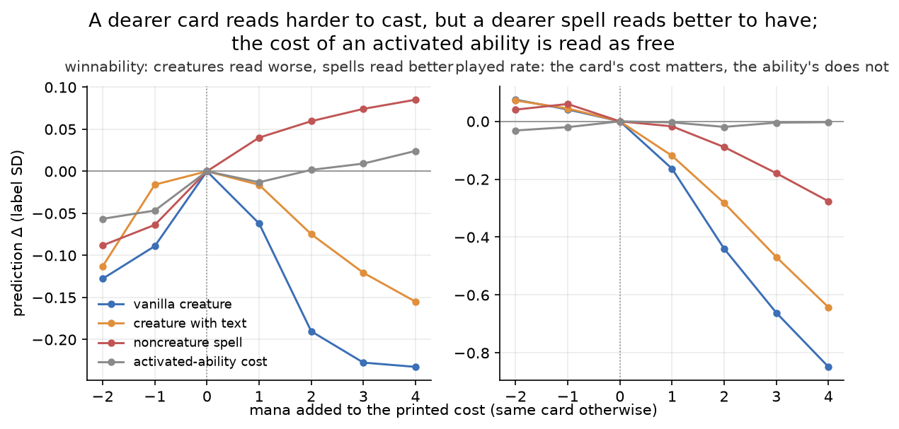
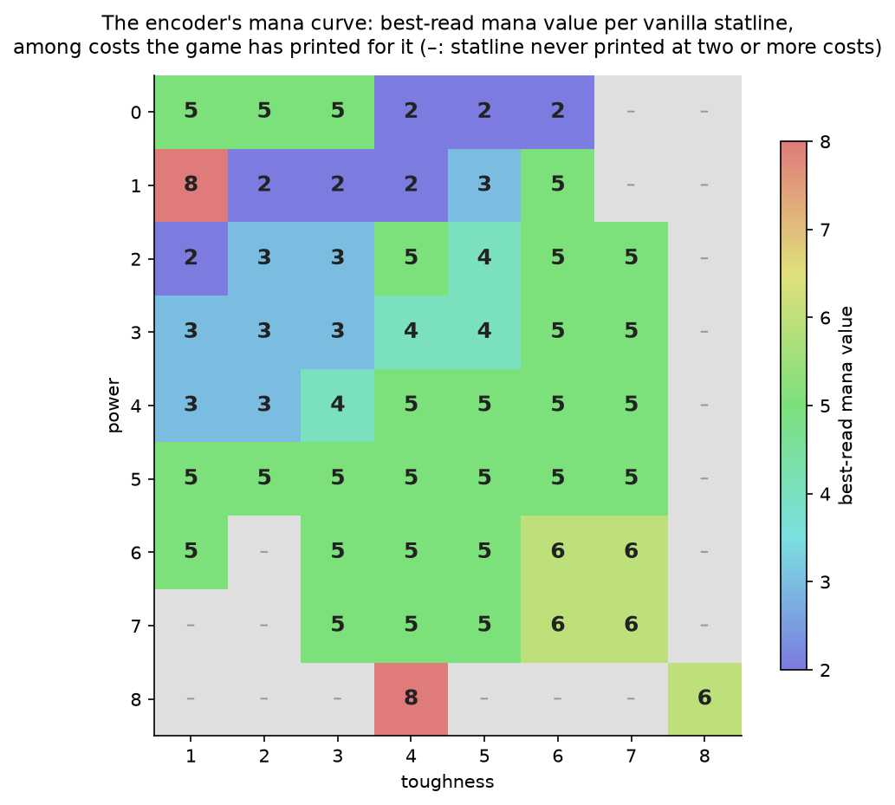
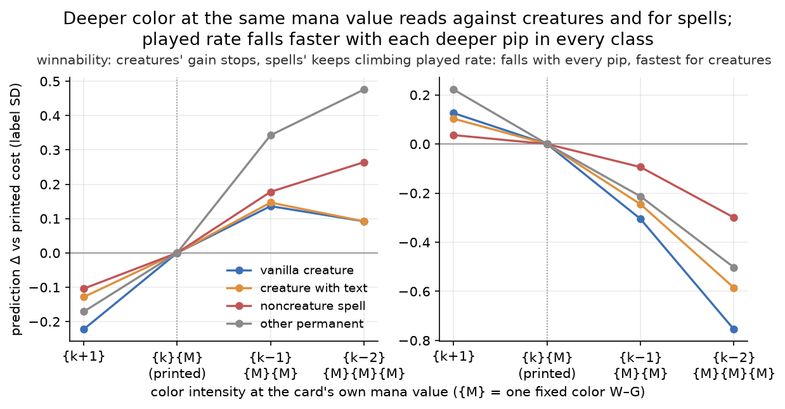

# What the card encoder reads

## The short version

- The best keyword in Forge's eyes is flying, worth about 0.4 label standard deviations on its own, followed by deathtouch, haste, double strike, and lifelink. Against a vanilla creature the labels reward every combat keyword; the clear liabilities are defender and flash. Keyword pairs are judged by how their rules fit together: an indestructible defender beats the sum of its parts, while haste on a defender and reach on a flier read as wasted lines.
- The best spell text is direct damage, then fight, exile, and destroy. Lockdown auras top all noncreature text. Sweepers, tap effects, and counterspells sit at the bottom, and a spell whose whole text is lifegain is the worst text the encoder knows.
- Bodies beat effects. The same effect is worth about 0.6 standard deviations more stapled to a creature than printed on a sorcery. A mana dork is fine and a mana rock is bad for exactly this reason.
- A mana more on the same card mainly lowers predicted played rate; predicted winnability drops only for creatures. Overcosting a spell even reads as an upgrade: the encoder learned that expensive spells are stronger spells and applies it with the effect held fixed, while real same-text card families lose about 0.13 SD of winnability per added mana. The mana cost of an activated ability, and the {T} in it, read as nearly free. Colored mana works on its own scale: at fixed mana value a creature's color premium stops at the second pip while a spell's keeps climbing, and played rate falls faster with every deeper pip.
- The encoder's card ratings are faithful copies of its training labels, and the labels are only partly about the card. A card's winnability label mixes three things: which deck builders were willing to play the card, how often it got cast, and whether winners cast it more than losers. Only the last part is about what the card does in a game.
- The encoder's loudest internal axis is not card quality but "will this card leave Forge's hand": lands and equipment at one end, morph, fogs, sweepers, and counterspells at the other. Mana cost explains only a seventh of that axis.
- The encoder reads words in context: "flying" is an upside on a creature's own ability line and a downside inside "can't block creatures with flying", and inverting a pump spell's sign or restricting removal to your own creatures moves the prediction the right way. But sixty percent of its transferable winnability knowledge survives shuffling every word, and layout changes that alter nothing move predictions as much as edits that invert meaning.
- The embedding describes the card better than it judges it. Mana value, power, toughness, and card type are all decodable from it more accurately than any label it was trained on, and even the card's printing era and rarity are recoverable from wording alone.
- A hand-built table of 135 nameable features nearly matches the encoder's winnability judgment on validation cards; the encoder's real advantage is in predicting cast frequency. The feature list itself is a product of this study, worked out by probing the encoder.
- Two of the label groups turned out to be artifacts: the play/draw split is nearly all sampling noise, and the color-affinity labels mostly re-encode color identity plus a shrinkage artifact that punishes good cards. The cast-lift label carries real independent signal and should stay.
- Half of what the encoder appears to know is memorized card identity. Its accuracy on validation cards is under half of its accuracy on the training set, and the memory is keyed to the card's text layout, not its words.

## Method and subject

The subject is the gen-4 production sealed card encoder, `models/sealed/encoder/full-20260517-014759-attn-6l-8h-8q-0.1mlm-512d.pt`: d_model 512, 6 layers, 8 attention heads, an 8-query attention pool producing a 512-dim card vector, 21M parameters. It was trained 2026-05-17 from random init on nine per-card regression labels aggregated from 974,028 Bo1 Forge-AI self-play games over 27,983 cards, plus a masked-token auxiliary loss, per [`specs/2026-05-03-card-winnability-pretraining.md`](../specs/2026-05-03-card-winnability-pretraining.md). A label is a training target: a per-card statistic measured from those game logs. The nine are the card's net win influence when cast, measured once on the play and once on the draw (the winnability labels — this document quotes the on-the-play one unless it says otherwise), the fraction of in-deck games it was cast at all (the played-rate label), the win-rate gap between games where it was cast and games where it stayed in hand (the cast-lift label), and five per-color affinity scores (the color-lift labels). The encoder learns to predict all nine from the card's rules text alone. The sibling study [`2026-08-27-scorer-preferences.md`](2026-08-27-scorer-preferences.md) examined the deck scorer built on top of this encoder; it established that the scorer consumes mainly the encoder's winnability axis, secondarily its played-rate axis. This study asks what card text produces those axes.

The method had three phases. Fifty-eight hypotheses were brainstormed, critiqued by four independent Opus reviewers, one of which ran label-level regressions against the real corpus, and consolidated into eighteen ranked study questions. A probe battery then tested them: several hundred thousand encoder forward passes and label-side analyses over the full game corpus, no training. Every probe lives in [`scripts/encoder_probes/`](../scripts/encoder_probes/README.md); staged outputs are under `output/encoder-probes/`.

Three instruments recur through the study.

1. Ridge probes stand in for the missing regression heads. The saved checkpoint contains no regression heads: the small output layers that turned the card vector into each label's prediction during training were not saved. A ridge regression refit from the cached card embeddings to the labels takes their place. The "fidelity" probe is fit on all cards and is used wherever a prediction just needs reading off. The "honest" probe is fit only on the encoder's own 22,387 training cards and evaluated on its 5,596-card validation set (the seed-42 split reconstructed exactly); every generalization claim uses it.

2. Counterfactual edits measure what a piece of text is worth to the encoder. An edit changes one thing in a card's converted text, re-encodes the card with the production checkpoint, and reads how the predicted label moved. The harness reproduces the cached embeddings bit-exactly, so a measured change comes from the edit and nothing else. Every edit is compared against a variant with the same line layout, because moving a line without changing its meaning already shifts predictions by about 0.3 label SD.

3. The label-SD ruler puts every effect on one scale. Raw label units are tiny and differ from label to label, so every effect in this document is divided by the standard deviation of its label across the corpus: SD(shrunk_score_play) = 0.0618, SD(shrunk_played_rate) = 0.1247. An effect quoted without a unit is in score_play SDs; a keyword worth "+0.27" moves predicted winnability by 27% of the card-to-card spread of the winnability label. One SD is a large step in card quality: the whole keyword ladder from best to worst spans about half of one, and the cards Forge's developers hand-blacklisted as unplayable sit about two-thirds of one below normal cards.

## A card can earn a strong winnability label without ever changing a game

A game's win cannot be cleanly attributed to any single card, so the winnability label shares the credit for a win, and the blame for a loss, among every card the side cast. The label counts the games the card's deck won with the card cast, minus the games it lost with the card cast, over all games the card sat in a deck. A card therefore gets credit for its deck's wins whether or not it caused them.

Three simpler quantities, called channels from here on, can be measured from the same game logs, and each one holds a different kind of fact:

- selection: how often decks containing the card win. Builder choice sets this: a card only the random builder plays is observed in decks that win 26% of their games, a card forge-best favors in decks that win 60%, and a deck's win rate flows into every card it contains. Which builders play a card therefore moves its winnability label by about ±1.8 SD before the card itself does anything.
- castability: how often the card gets cast.
- contribution: how much more often the card is cast in the games its decks win than in the games they lose. This is the only channel that measures the card changing games: it is positive when winners cast the card more often than losers did.

The winnability label equals `castability × (2·selection − 1) + contribution/2` exactly. The channels are therefore not new information: they are the same number, computed in a way that keeps its ingredients apart.

One detail of the castability definition carries the identity. Castability averages the card's cast rate in won games and its cast rate in lost games, weighting the two equally rather than by how common wins are; that weighting is what makes the identity exact and keeps the contribution term free of selection. It also means castability slightly understates a strong card's true cast rate, because strong cards are cast more in wins and their decks win more often. The understatement is the product of those two deviations, both of which are bounded; for the top 1% of cards by label it is about two percentage points of cast rate.

The rest of the document states its findings as premiums: a feature's premium is how much it moves the winnability label, measured against cards matched on cost and type, and a negative premium is a penalty. Every premium is read through this split, because a premium carried by the selection channel is inherited builder taste and only a premium carried by the contribution channel is evidence the card changed games. The decomposition for the headline card classes:

*Source: `l_mediation.py` / `l_analyze.py`, WLS with MV and type controls, n ≥ 50 per class; rendered by `make_figures.py`.*

Each bar in the chart is one channel's share of a class's premium, not the channel's own value: the class's deviation on that channel, multiplied by what that deviation is worth to the label at the corpus average. The black dot is the class's exact premium. The bars sum only approximately to the dot. The gap is the part of the premium produced by two channels deviating at once, which no single bar can carry, and it stays under 0.13 SD in every row.

Creatures get most of their premium from the selection channel, before any game starts. Creature-heavy decks are the decks that win in this corpus, and the best builder in the pool fills its decks with creatures. The label shares each win's credit among every card the winner cast, so any creature in such a deck collects credit for the deck's wins, whether it was the best card in it or the 23rd. Creatures are also cast far more often than noncreatures: a bear is simply played on turn two, while a situational spell waits in hand. That difference adds almost nothing. The rest of the premium is contribution: winning boards are boards with creatures on them. Unconditional removal has the same composition, with most of its premium in the selection channel.

A combat trick reaches nearly the same premium as a creature with essentially no selection share. Decks that run tricks win no more often than decks without them: a Giant Growth in the decklist says nothing about the deck's quality. Tricks are also cast slightly less often than the average card, because a trick sits in hand waiting for the right combat, and sometimes the right combat never comes. The whole premium is contribution: winners cast their Giant Growths, and losers die with them in hand. A pump spell is only cast into a fight worth winning (eating a blocker, forcing through lethal), so the cast causes the win and coincides with it at once, and the label cannot separate the two.

Sweepers set the selection and contribution channels in direct opposition. Good builders include sweepers, so a Wrath of God in a decklist marks a well-built deck, and the selection share is positive. The contribution share is negative and larger: when the sweeper is actually cast, it is disproportionately in games its side loses. A sweeper comes down when the board has gotten away from its caster, and the side that was ahead usually wins even after the board is cleared. The class nets slightly below average. The corpus's bad builders are not the cause: in games where the forge-best builder plays against itself, a cast sweeper still appears mostly in losses.

In short: a creature is good because of the company it keeps, a trick is good because of when it appears, and a sweeper is the card whose company vouches for it while its appearances testify against it.

The castability bar is near zero for every class, and its sign says nothing about card quality. Being cast a lot only means being present for whatever the deck was going to do anyway: each cast earns credit if the game is won and blame if it is lost. The average card's deck wins 46.5% of its games, because the corpus deliberately includes bad builders, so one cast is worth slightly less than nothing. Each class's bar multiplies its extra or missing casts by that value: creatures, cast more than average, get a small negative bar; sweepers, cast less, a small positive one. Morph is the extreme case: its recorded cast rate falls further than any class in the table and its label barely moves, because a card that is never cast is never blamed. The channel is still worth separating, because with the number of casts removed, the contribution bar measures only when a card is cast, not how often.

Recomputing every effect inside the forge-best-vs-forge-best mirror, where both sides' builder and opponent are held fixed, changes almost nothing. The counterspell penalty is the one effect that vanishes in the mirror: it is a builder-selection artifact, not a card fact. The expensive-is-good gradient survives the mirror and every game-length stratification at full strength: it is not an artifact of expensive cards being cast only in games that had already gone long.

Two annotation channels leak into the labels from outside the games. Cards on Forge's hand-written `AI:RemoveDeck` blacklist carry a 0.64 SD winnability deficit of which 78% is the selection channel, and Forge's bundled human draft rank correlates with the winnability label almost entirely through selection. Both are inherited taste, not game evidence, and the encoder can only partly see them: on validation cards it over-predicts blacklisted cards by about a fifth of a SD. The text explains a third of the blacklist deficit; the other two thirds is invisible to a text reader.

For one class of cards, every label is corrupted at the source. The Java match worker never logs a face-down card: a face-down cast resolves to an empty name and is dropped, and turning face up fires no event the collector subscribes to (`PlayedCardCollector.java`; the in-code comment claiming the cast branch covers it is wrong). A morph creature that spends the whole game face down is recorded as never played, which is why morph creatures carry the largest played-rate collapse in the corpus. The encoder learned this corpus fact faithfully; the reading "Forge cannot play morph" is false.

## Flying tops the keywords, direct damage tops the spells, and any effect is worth more on a creature

Flying is the most valuable keyword under counterfactual edits, and two independent edit designs agree on the whole keyword order (Spearman 0.94).

The first design swaps keywords on the same card. Each of 2,913 base creatures carries one keyword in a static line; the probe replaces that keyword with each of the others in turn and re-encodes. The change in predicted winnability measures how much better one keyword is than the one it replaced. Each keyword then gets a single value on a common scale, chosen so that the differences between the values match the measured swap effects.

The second design deletes keywords instead of swapping them. It takes the real cards that carry a keyword line, removes that line, and re-encodes; the drop in predicted winnability is the keyword's value. The deletion design gives larger values than the substitution design, in the same order.

The figure also shows each keyword's label value: what carrying the keyword is worth in the winnability labels of real creatures, measured against keywordless creatures of the same cost and statline, then centered on the same zero as the edit scale. Against a vanilla creature, every combat keyword has a positive label value; haste, vigilance, first strike, and trample are each worth about a fifth of an SD. Only defender and flash have clearly negative label values. Haste's label value is almost entirely the contribution channel: haste creatures that get cast appear mostly in wins, while deckbuilders pick haste carriers no more often than other creatures. The edit and label orders agree (Spearman 0.87). Where they differ, the direction varies: the edit value for haste is a tenth of an SD above its label value, flash and indestructible are about a quarter above, double strike is below, and hexproof's edit penalty is about twice its label penalty.

*Source: `c1_keywords.py`; label values from the vanilla-baseline joint regression in `c8_kw_vanilla.py`; rendered by `make_figures.py`.*

The flying premium peaks on mid-size bodies (power plus toughness 5–8) and falls back on the largest, in both edit designs.

Keyword pairs are judged by how their rules fit together. The pair sweep adds every pair of the sixteen keywords as two static lines to 150 mid-size keywordless creatures, reads the predicted winnability against single-keyword arms, and removes each keyword's average interaction so only the pair-specific part remains. The strongest positive interactions are pairs where one keyword makes the other more useful: defender with indestructible, hexproof, or shroud (a blocker that is hard to remove keeps blocking), flash with haste (a creature cast at instant speed can attack immediately), and double strike with lifelink or deathtouch (double strike deals damage twice, so both abilities trigger twice). Among the largest negative interactions are pairs where one keyword cannot be used: a creature with defender cannot attack, so haste does nothing for it, and a creature with flying can already block fliers, so reach adds little. The largest negative interaction, flash with ward, has no such explanation. The pair-specific effects reach about half the size of a strong single keyword, and most pairs move the prediction beyond their confidence interval in one direction or the other. All of this is encoder-only: real cards carrying any given pair are too rare for a label-side check.

*Source: `c9_kw_pairs.py`, all 120 pairs, each keyword's mean interaction removed; the chart shows the eight largest in each direction, with deathtouch + trample as a reference row.*

Deathtouch plus trample, the classic keyword combo, is worth barely more than the two keywords separately. A pair's interaction is only defined relative to a reference: a 2×2 that measures a pair against two chosen control keywords includes the controls' own interactions in the result, and vigilance with trample alone contributes −0.09. Every value here is therefore centered against all 120 pairs.

Direct damage to any target tops the spell-effect ladder, and a spell whose whole text is "you gain 4 life" is the single worst text measured. The ladder writes fifteen different effect texts into the same 200 base spells, and it spans three times the keyword scale. Removal ranks above card advantage: fight, exile, and destroy are high, bounce, card draw, and counterspells are near zero or below, and tap effects and sweepers are heavily negative.

Two entries in the ladder revise findings from the scorer study. Fight is not undervalued, in the labels or in the encoder, so the builder's refusal of fight spells is a search-level behavior. Lockdown auras beat every removal template. Inside the aura family, "enchanted creature can't attack or block" and "can't block" differ by 0.77 SD on two words: the clearest case in the study of two words moving a prediction by their meaning.

*Source: `c3_removal.py`, fifteen effect templates substituted into the same 200 base spells; rendered by `make_figures.py`.*

Any effect is worth more on a creature than on a spell. The probe writes the same effect twice: once as a sorcery, and once as a creature that performs the effect when it enters the battlefield. The creature version is worth +0.60 on average. Weak effects gain the most and the strongest can even lose: lifegain gains +1.5 by becoming a creature, while destroy-a-creature loses a little. The same design reproduces the corpus's largest class gap at identical cost and text: a creature that taps for mana scores 0.33 higher than an artifact with the same ability. Mana rocks are not penalized for the artifact type; they are penalized for lacking a creature body.

Creature-type nouns carry real value, at a smaller scale than the label side shows. Renaming a dragon to a lizard at identical statline and text moves the prediction by −0.27. The noun ordering (angel, wurm, hydra at the top; goblin, wall, lizard at the bottom) matches the label-side ordering at a third of its spread. About two-thirds of the corpus dragon premium is therefore statline and text; one third is the word itself.

## An added mana lowers played rate; a dearer spell reads as a stronger spell

Raising the same card's mana cost lowers its predicted played rate in every card class, but lowers its predicted winnability only for creatures — an overcosted spell reads better, not worse. The probe rewrites the generic part of a card's printed mana cost to every value from zero to eight, keeps the colored pips and every other line, and reads both heads at each step, on 150 cards each of vanilla creatures, creatures with rules text, and noncreature spells.

*Source: `c10_cost_sweep.py`; generic cost swept {0}–{8} on the card's cost and {0}–{6} on the ability's, colored pips kept; the activation series averages the with-{T} and without-{T} cost shapes; rendered by `make_figures.py`.*

Predicted played rate falls with every added mana, fastest for creatures. One mana added to a vanilla creature lowers it by 0.16 SD and four mana lower it by 0.85; making the card cheaper raises it. On spells the drop is about a third as steep, and the first added mana moves nothing. These slopes mirror the corpus at large, where mana value and the played-rate label correlate at −0.30 among creatures and near zero among spells. The same-text families below tell a different story: a spell's played rate also falls, by 0.12 SD per added mana, a slope the encoder reproduces only in part and not at all for the first mana.

Extra mana lowers a creature's predicted winnability and raises a spell's. A vanilla creature overcosted by two mana loses 0.19 SD, growing to 0.23 by four. The same two extra mana on a noncreature spell raise predicted winnability by 0.06, and four raise it by 0.09.

The spell-side rise mistakes a fact about the card pool for a fact about the card. Dearer printings carry stronger effects, so across real cards a mana more predicts a better winnability label (weighted r = +0.16 among noncreature spells, +0.23 among creatures). With the text held fixed, the corpus says the opposite. Across 131 families of real cards identical apart from name and mana cost, one added mana lowers winnability by 0.13 SD and played rate by 0.12, and by 0.32 among the 22 creature families; Counterspell and Cancel are one such pair, and the cheaper twin has the better label. A statline gives the encoder something to weigh the cost against — a 2/2 for four mana reads worse than a 2/2 for two — so creatures show part of that slope, about a third of the families' rate. A spell's text offers no such anchor, so the pool-level rule wins and the prediction moves the wrong way.

A cheaper card also reads as a worse card. Making a vanilla creature one mana cheaper lowers predicted winnability by 0.09 SD, a spell by 0.06, and no class's prediction rises on the cheap side. Part of that drop hits any cost the card was never printed at — the {T} contrasts below put that part near 0.05 — but the same-text families show a one-mana-cheaper card is about 0.13 SD better, and the encoder never reflects it.

Behind the cheap-side dip, the encoder has learned which costs are normal for a body, not a mana-for-stats exchange rate. The probe writes every statline from 0/1 to 8/8 onto 100 real vanilla creatures — vanilla in the strict sense, converted text of nothing but cost, types, and statline — keeps one pip of each card's own color, and finds the mana value from 1 to 10 where predicted winnability peaks. Through the playable range that best cost tracks the game's own curve from at or one step above it: a 2/2 peaks at mana value 3, a 3/3 at 3, a 4/4 and a 5/5 at 5, a 6/6 at 6. Every bigger body also peaks at 5 or 6, because statline numbers this large read as interchangeable. Undercosting is the sharpest evidence that the encoder reads normality rather than value: a vanilla 2/2 for a single pip — Isamaru's statline, a historically strong card — reads half an SD below the same 2/2 at two mana. An aggressively costed card reads as abnormal, not as strong. The best costs reported for bodies of power 0 or 1 mean nothing: such a body reads badly at every cost — a 1/1's predicted winnability never clears 0.01 — and the peak of a flat curve lands wherever it wobbles.

*Source: `c12_on_curve.py`, 100 real strict-vanilla bodies re-statted to every P/T in 0–8 × 1–8 and swept over mana values 1–10 with one pip of their own color kept; rendered by `make_figures.py`.*

A colored mana is not a dearer generic mana: at the same mana value, more color raises predicted winnability and lowers predicted played rate. Swapping one generic mana for a colored pip ({1}{W} → {W}{W}, and likewise in every color) raises predicted winnability by 0.06 to 0.16 and lowers predicted played rate by 0.16 to 0.37, against 0.16 for a whole added generic mana. Erasing the pip instead ({1}{W} → {2}) lowers winnability by 0.09 to 0.30 and raises played rate by 0.05 to 0.22. This is the scorer study's color economics at the single-card level: a color-heavy card goes only into decks committed to its color, which the selection channel rewards, and is harder to cast on curve, which the played-rate label records.

Deeper color splits by card class the way extra mana does: a creature's winnability gain stops at the second pip, a spell's keeps climbing with every pip, and every class's played rate falls faster with each deeper pip. Across the four color intensities a card's own mana value allows — all-generic through {M}{M}{M}, writing {M} for one fixed color since {C} is the game's colorless symbol — a creature's second pip is worth about 0.14 of winnability and its third gives a third of that back, identically for vanilla and texted creatures. A spell keeps climbing, to 0.26 at three pips, and the other permanents to 0.48: with no statline to weigh the commitment against, deeper color reads as a stronger card, the same mistake that favors a dearer spell. Played rate drops fastest for creatures: the mono-colored form sits 0.75 below the printed cost on vanilla creatures and 0.59 on texted ones, against 0.30 on spells. Stripping the only pip lowers winnability everywhere, most in white and green (0.27 and 0.21) and least in blue (0.05). The probe covers 1,055 real single-pip {k}{M} cards, k 2–6; every edited form stays on the corpus manifold except the colorless-cost vanilla creature, a shape the game rarely prints, which strays 14% of the time.

*Source: `c11_pip_ladder.py`, 1,055 real single-pip {k}{M} cards (k 2–6) re-encoded at the four color intensities of their own mana value; the fixed-cost conversion contrasts from `c2_statlines.py`; rendered by `make_figures.py`.*

The cost of an activated ability is read as free. The same sweep applied to the generic mana in the first activated ability of a creature (mana abilities excluded) moves both heads by at most 0.07 SD across the whole {0}–{6} range, with no consistent slope. What little structure there is matches the spell pattern: the largest single move is a drop for making the ability one mana cheaper, and four mana added to it read slightly better, not worse. A dragon whose firebreathing costs {3}{R} reads the same as one whose firebreathing costs {R}.

The {T} symbol is read as worth almost nothing. Dropping ", {T}" from a mana-plus-tap activation cost lowers predicted winnability by 0.08, adding ", {T}" to a mana-only cost lowers it by 0.02, and replacing a bare {T} cost with {1} moves nothing. The two edits disagree about the symbol's sign and agree that the edited arm loses, so most of both numbers is the unprinted-cost drop; netting it out leaves about +0.03 for {T} itself. In the game, losing {T} is a large upgrade — the ability works the turn the creature arrives, and more than once a turn. None of that reaches the encoder: it reads the cost's wording, not the rules consequence.

## The nine labels carry about three distinct signals

The three that survive are winnability, played rate, and cast lift; the other six labels are copies or artifacts. The second winnability label duplicates the first, and the five color-lift labels reduce to color identity plus a shrinkage artifact.

The play and draw labels are two copies of the same signal. In the raw labels the two correlate at 0.74, and their difference is almost entirely sampling noise (split-half reliability near 0.10). The encoder collapses them further: its predictions for the two correlate at 0.95. A trace of the split survives, correctly signed: defenders, sweepers, and kicker cards measurably prefer the draw in both the labels and the predictions, and haste leans to the play, all at about a twenty-fifth of the winnability signal itself. The split bought almost nothing.

The cast-lift label looks just as redundant and is not. In the raw labels, cast lift is nearly the same quantity as the contribution channel (the two correlate at 0.96). But contribution is exactly the valuable part of the winnability label, and cast lift is the only label that carries it on its own. The extra information is measurable on validation cards: the predicted winnability, the predicted played rate, and mana value together explain 32% of the cast-lift label, and adding the predicted cast lift raises that to 48%. Only a sixth of what the cast-lift probe reads from the embedding overlaps with what the other probes read. The label stays.

The five color-lift labels mostly restate the card's own colors. A card's color-lift value for a color is zero by construction whenever that color is one of its own, because a card's colors are always present in its own deck. Knowing which of the five values are zero is therefore the same as knowing the card's colors, which the mana cost gives away (the embedding decodes color at AUC 0.99), and that alone accounts for over half of what these labels ask the encoder to predict.

The nonzero values were meant to measure affinity: does the card win more when its deck also plays that color? What they mostly measure instead is the card's own quality, with the sign flipped. Each value subtracts the card's overall win score from its win score in decks that play the color. Both scores are pulled toward zero to tame small samples, and the with-color score rests on fewer games, so it is pulled harder. Subtracting a lightly-pulled score from a heavily-pulled one leaves a remainder proportional to the score itself, so the better the card, the more negative its color-lift values. A real color preference survives underneath, in both the labels and the encoder's predictions, but it is tiny: allied colors beat enemy colors by about 1.5% of a color-lift SD. The rest is genuinely absent rather than hidden, because a probe that can read nonlinear patterns finds no more of it than the linear one: the cross-color synergy these labels were designed to teach never made it into them.

## Half of the encoder's knowledge is memorized card identity

On the cards in its training set, the encoder explains 81% of the card-to-card variation in the winnability label; on the 5,596 cards in its validation set, 37%. The probe that reads these numbers out is not the cause: fit on one half of the training set, it does just as well on the other half, so the gap comes from the embeddings themselves. The encoder gives its training cards embeddings that carry their labels, and gives validation cards only what their text implies. In standard terms this is overfitting; the rest of the section measures how much of the fit is memorized and what the memory is keyed on.

The storage works because text can serve as a name as well as a description. With card names stripped, 99% of cards' converted text is unique in the corpus, so a card's exact wording can act as its identifier, and training pushes each unique wording's prediction toward that card's own measured label until the value is simply stored. The text supplies only the key; the stored value arrives through the other half of training, the measured label itself.

*Source: `r2a_memorization.py`; the line-shuffled bar from `r1a_shuffle.py`; rendered by `make_figures.py`.*

The stored key is the line layout more than the words. Swapping two ability lines, which changes nothing about what a card does, disturbs training-set cards' predictions 20–56% more than it disturbs validation cards'; swapping a creature type for an equally common one disturbs both the same. And destroying line order collapses the training-set fit most of the way down to the validation fit, as the middle bar of the figure shows.

For the pipeline's stated purpose, scoring invented cards, the validation numbers are the honest ones: 37% of winnability, 61% of played rate. Comparing two versions of the same card stays safe, because the memorized part is the same on both sides and cancels in the difference. A single absolute score does not. An invented card must also be written in the converter's standard line order, because unusual layout moves a prediction more than most real content changes.

## The encoder reads words in context, but meaningless edits move predictions as much as real ones

Word order carries a substantial share of the encoder's transferable knowledge: destroying it costs 40% of the validation-card winnability accuracy and 62% of the cast-frequency accuracy. The measurement shuffles each card's words, re-encodes the result, refits the probes on the shuffled embeddings, and scores them on validation cards:

*Source: `r1a_shuffle.py`, two seeds averaged; rendered by `make_figures.py`.*

Context is read correctly wherever a direct test was run. The word "flying" is read by the role it plays: worth +0.52 as a creature's own static line, 13% of that inside a spell that merely grants it, and negative under "can't block creatures with flying", where it marks a drawback. Restricting "destroy target creature" to "you control" lowers the prediction, and so does flipping +N/+N to −N/−N, each by about 0.14 SD beyond what a meaning-free control edit moves.

The response sizes are what is wrong: an edit that blanks a card moves the prediction no more than an edit that changes nothing. Rewriting the line "enchanted creature can't attack or block" into "CARDNAME can't attack or block" strips a pure Pacifism of its whole effect, because the aura itself could never attack or block anyway. On the ten auras whose lockdown is their whole text, the encoder reads the loss correctly: nine of ten predictions drop, by −0.35 SD on average. Swapping the same cards' two static lines, which changes nothing at all, moves predictions just as far.

Appended riders are read on some lines and merely counted on others. A clause appended to a spell's line adds about +0.09 whatever it says, a drawback included. The same kind of rider on a creature's own triggered line is actually read: a self-sacrifice rider moves the prediction by −0.20 and a +1/+1-counter rider by +0.20. A cantrip rider nets exactly zero against a matched control, and the labels put cantrip riders at nothing, so there the encoder agrees with them.

## The embedding is a card description first and a judgment second

Every attribute printed on the card decodes from the embedding better than any label the encoder was trained on. Linear decoders on validation cards:

*Source: `q3_decode.py`; rendered by `make_figures.py`.*

Era and rarity are decodable even though nothing in the converted text names a set or a rarity. The encoder has learned design-language fingerprints strong enough to date a card within eight years and to separate rares from commons, without ever being asked to.

Number tokens keep their order only where they are common. Decoded power tracks printed power nearly exactly through 4, compresses above 5, and goes flat past 8. A statline sweep shows the same collapse in the predictions. The sweep takes thirty real creatures and rewrites each one's power-toughness line to N/N, once for every N from 0 to 12, leaving cost and abilities untouched. Re-encoding each variant and reading its predicted winnability gives a curve that rises through the middle sizes and then falls back, until the 12/12 version scores the same as the 0/0 version. The {X} symbol is read as exactly one generic pip, everywhere: the encoder knows X-spells are castable early and does not know they scale.

*Source: `c2_statlines.py` (left) and `q3_decode.py` (right); rendered by `make_figures.py`.*

The flat top of the sweep reflects missing number information, not a learned law of diminishing returns. The labels themselves do diminish: mean winnability plateaus at printed power 5–6 and declines past 8. Training therefore never rewarded telling the big numbers apart, and cards that big are also rare (85 creatures at power 8, 10 at power 12). The sweep still rules out the diminishing-returns reading. It changes only the statline, so within the sweep a bigger body is an upgrade in essentially every game. Genuine diminishing returns would keep the 12/12 at least as good as the 8/8. The sweep instead scores it half an SD lower, level with the 0/0. The token embeddings show where the information stops. The integers 1 through 7 line up along one direction in embedding space, evenly ordered by value. Every integer from 8 upward lands on that direction at roughly a four, in no consistent order.

*Source: `q4_token_geometry.py`.*

The 8-query attention pool did not specialize. Any single 64-dim query block recovers 95–96% of every label's prediction accuracy, all eight blocks' leading axes correlate above 0.97, and the attention profiles are near-uniform with no query attending to statlines or costs. The spec's intent of one query per card aspect did not materialize; the pool is a learned mean, matching what the scorer study found for the scorer's pooling one level up. The whole card cloud has an effective dimensionality near 3.

A hand-built table of 135 nameable features nearly matches the encoder's winnability judgment on validation cards; the encoder's clear advantage is played rate. The table lists mana value, card types, power and toughness, keyword and phrase flags, colored pips, ability-line counts, and era, rarity, and set. It feeds gradient-boosted trees, fit on the encoder's training cards and scored on its validation cards; the encoder's side of the comparison is the honest probe on the same split. Combining the embedding with the table improves on the embedding alone by almost nothing, so the table holds essentially nothing the encoder lacks. The reverse does not hold, and the missing part is concentrated in played rate. The comparison is also retrospective: which features to put in the table was itself worked out by probing the encoder and its labels, so the table summarizes what the encoder learned rather than a model anyone could have written before training it.

| head | 135-feature table (val R²) | encoder probe (val R²) |
|---|---|---|
| winnability | 0.349 | 0.370 |
| played rate | 0.346 | 0.608 |

*Source: `s_r18*.py`, both models fit on the encoder's training split and scored on its validation split.*

## The encoder disagrees with its labels in the response, not in the ranking

The encoder's outputs are distributed like its labels while its response to an edit is a different function. Across the keyword battery, correlational effects computed on the encoder's predictions match the label-side effects at r = 0.97, and the counterfactual effects match them at r = 0.86 once both scales share the vanilla-creature baseline from `c8_kw_vanilla.py`. The residual table shows the same agreement: of 246 feature-label pairs tested for prediction-minus-label bias, ten clear the reporting bar, and seven of those are observation-count strata or the blacklist. The two genuine disagreements are planeswalkers (under-predicted by 0.14, loyalty text reads worse than it plays) and morph's played rate (over-predicted, the logging artifact resisting text explanation).

Where the edit response diverges from the labels, the encoder errs in both directions, and its generalization mode explains most of it. Haste reads a tenth of an SD better than it plays, and flash and indestructible read about a quarter better, above labels the games set low. Double strike reads worse than it plays, and hexproof's edit value is about twice as negative as its label. Lifegain text reads at −1.2 where labels are neutral, and any appended clause gains the wordiness bonus. On validation cards the encoder's prediction sits closer to the mean label of a card's templating neighborhood than to the card's own label (β 0.59 versus 0.26), so a card is scored as the average of cards worded like it, and a keyword that plays unusually well or badly for how it reads is pulled toward how it reads.

## Consequences for the next encoder generation

- The play/draw split spends half of the winnability training signal on a distinction the labels barely contain and the encoder discards. A single winnability label plus the cast-lift label covers what the games can teach.
- The color-lift labels need a redesign before they can teach affinity: match the shrinkage denominators so the artifact term cancels, or drop the family and keep color in the deterministic pips, which is where the scorer reads it anyway.
- Fix the face-down logging hole in `PlayedCardCollector` before the next corpus is generated; morph-block sets are currently mislabeled at the source.
- The layout sensitivity and part of the memorization have a plausible common cause in the positional encoding. Positions are learned absolute indices over the flat token stream, so reordering two lines changes every token's embedding, and the exact word-and-position pattern is a high-precision fingerprint to store labels against; the converter also emits lines in near-fixed order, so line-order invariance is never learnable from the data. The principled fix is hierarchical: encode lines as an unordered bag and words as an ordered list within their line, with a line-type embedding (static, spell, triggered, activated) carrying the slot information the composition results show matters. Cheaper approximations are canonicalizing line order at tokenization time or augmenting training with line permutations.
- The encoder's edge over hand-built features is played rate, not winnability, so work aimed at deck quality should improve the winnability signal itself (richer contribution-channel labels, e.g. per-game cast records rather than per-card aggregates). The 135-feature table is not a replacement for the encoder: its feature list came out of this study, and it loses badly on played rate. Its interesting use is as a candidate basis for rewriting Forge's own hand-coded card evaluator, which scores cards from exactly this kind of nameable feature.
- The winnability head treats mana cost the way it behaves across the card pool (dearer printings are stronger cards), not the way it behaves on a single card (the same-text families lose winnability with every added mana). On real cards the pool-level pattern is the better predictor, so nothing is lost in the sealed pipeline. It only misleads when the encoder is asked to score a card at a cost it was never printed at — a card-design or rebalancing use would need a within-family training signal, and the corpus's same-text families are only 327 cards.
- Two data-hygiene fixes landed during the study: the stale `village_watch` filename correction and a locator prefix-match bug that silently resolved missing cards ("Undercity") to unrelated files; both affected the gen-4 training inputs marginally.

## Limitations

Counterfactual deltas are read through refit linear probes, not the discarded training heads; the probes reproduce label-side effects to the third decimal where both exist, but absolute head scale is not recoverable. Edited cards are gated on nearest-neighbor distance to the real corpus, and conclusions were checked against the gated subset; multi-keyword ladders past three keywords and the synthetic body-vs-spell shells remain mechanism demonstrations on text the corpus never contains. The label-side channel decomposition controls builder and opponent identity but not deck context beyond it. Everything here is a property of this checkpoint trained on Forge-AI Bo1 self-play; none of it is a claim about human Magic. The morph finding is about the logger, not the AI, and any morph-related label in the corpus should be treated as unusable until the collector is fixed.
