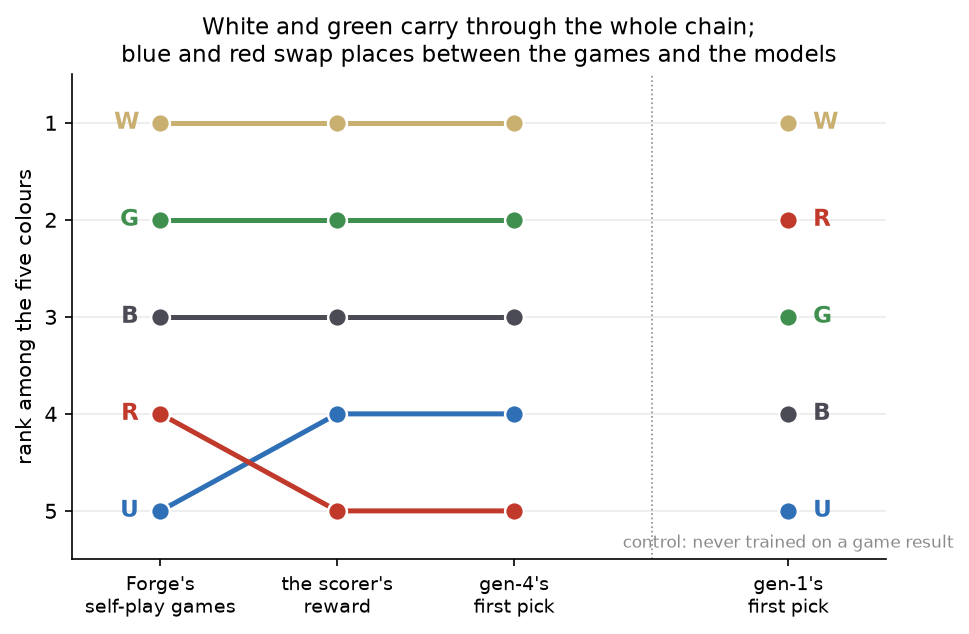
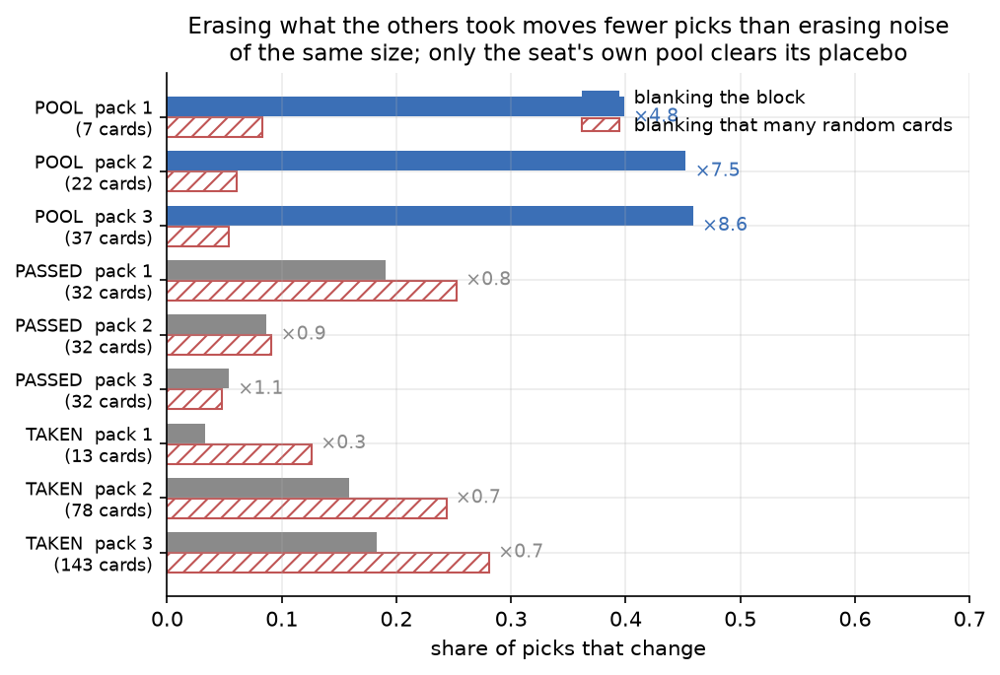
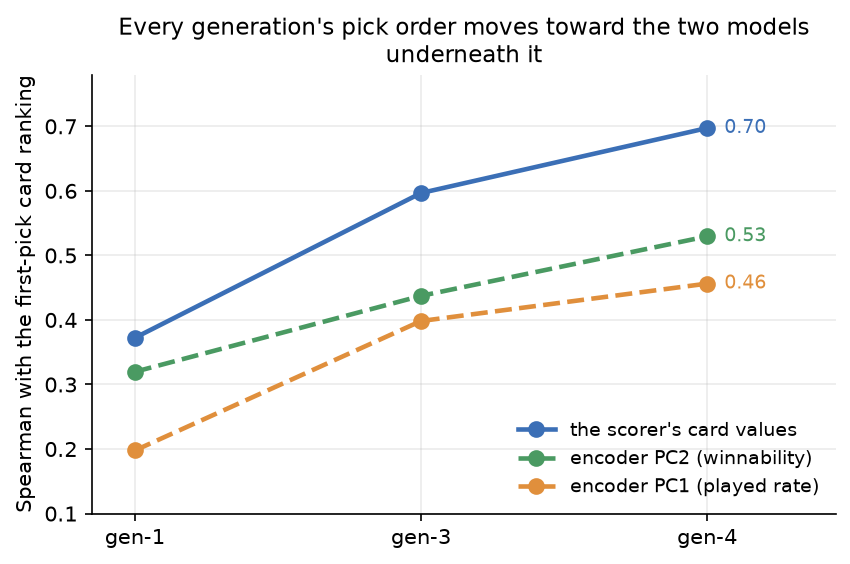
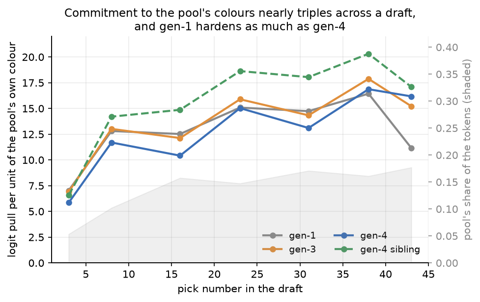
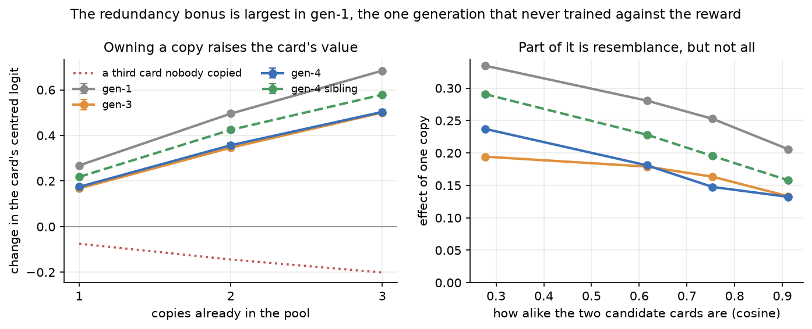
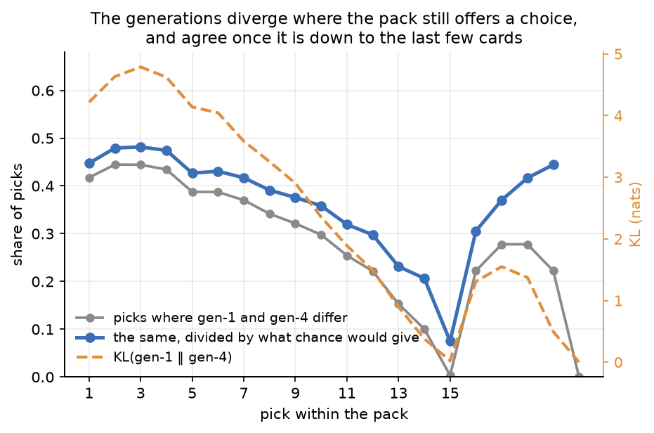
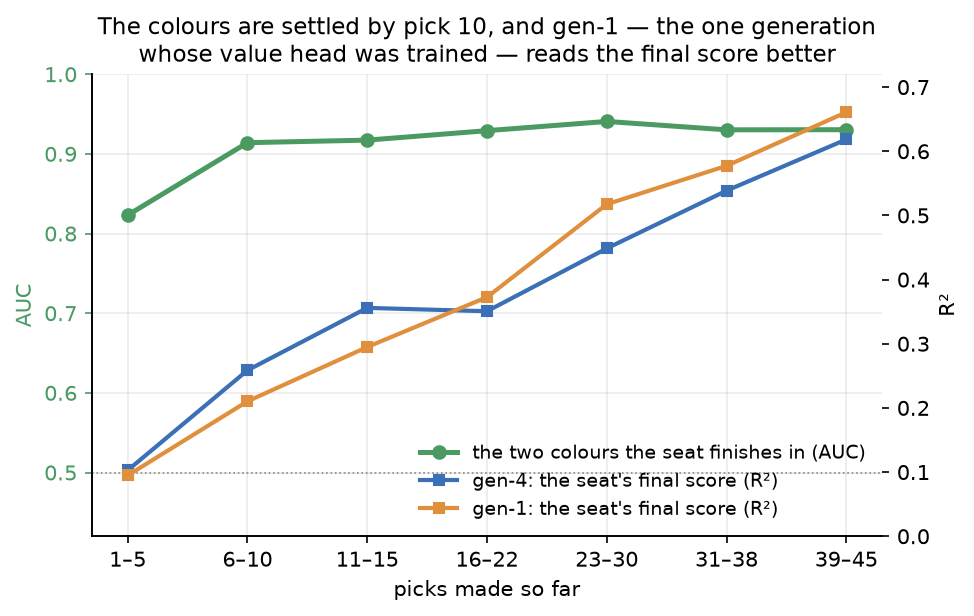

# What makes the draft agent a good drafter

## The short version

- Its colour preference comes from Forge's own games. White decks win more across
  the self-play corpus the encoder and scorer were fitted to, and the reward
  carries that to the policy. The chain inverts at the bottom: the games rank blue
  worst, both models rank red worst.
- **It cannot read signals.** Erasing what the other drafters took moves its
  picks *less* than erasing the same number of random cards, and gen-1 is the
  same, so this was never learned and never lost.
- What it does read is which cards are its own. Relabelling its pool as cards
  others took — no card changed, no count changed — moves two picks in five, and
  that alone produces its two-colour discipline.
- It drafts from a sharper pick order rather than a better read of the table.
  About half its picks are settled by a fixed ranking that ignores the board, and
  that ranking moved onto its reward's: down on removal and card draw, up on
  creatures.
- It prefers redundancy, valuing a card it already owns above an equally good one
  it does not. The reward is blind to duplicates, so this is inherited from Forge
  rather than learned.
- It starves the drafter it feeds, at about the cost of one more strong drafter
  in the pod. The agent cannot see seat order, so this follows from its taste
  rather than from a strategy.
- Underneath, its learning went where the reward could see it, and part of what
  looks like learning is drift that continues after the strength stops.

## Method

This is an interpretability study of the gen-4 production draft agent: which
drafting strategies it uses, which it does not, and which habits are its own. It
follows the studies of the deck scorer that supplies its reward
([`2026-08-27-scorer-preferences.md`](2026-08-27-scorer-preferences.md)) and the
card encoder that supplies its inputs
([`2026-08-28-encoder-preferences.md`](2026-08-28-encoder-preferences.md)).
Thirty-eight hypotheses were brainstormed, critiqued by four independent
reviewers and consolidated into sixteen, then tested by the inference-only probe
battery in [`scripts/draft_probes/`](../scripts/draft_probes/README.md); each
section names its script.

The subject is `models/draft/agent/gen4/lr1e-5_t2all_decay0.3.pt`, the strongest
of four gen-4 candidates on the yardstick; its sibling `lr1e-5_t2all_nodecay.pt`
is the same base and settings on a different run, and supplies the noise floor
([`2026-08-09-draft-agent-gen4-online-grpo.md`](2026-08-09-draft-agent-gen4-online-grpo.md)).
The corpus is the promoted checkpoint's `v-forge` yardstick run — 500 drafts,
eight-seat pods, three packs of fifteen, with `gen4`, `gen1` and `forge-full`
seats in every pod at argmax. Corpus-side analyses pool all four candidates'
runs, 2,000 drafts and 16,000 seats.

Three rules run through every measurement, and each changed a result. **Every
number carries a gen-1 column**, because gen-1 distils Forge's `LimitedPlayerAI`
and a behaviour it already has is Forge's. **Only within-state logit contrasts
count**, because the policy head is invariant to a constant added across a state.
**Edits preserve token count**, because a deleted block changes how many tokens
the trunk averages over; blocks are blanked by substituting a corpus-mean card
vector and read against a random substitution of the same size.

Every comparison between agents below is measured on shared states, which is what
makes them comparisons of judgement rather than of luck. An agent with unusual
colour preferences is passed different packs, and the states it reaches are
produced by its own earlier picks; running each policy on the states another
policy actually faced removes both confounds, and neither turns out to matter.
Argmax agreement between gen-1 and gen-4 is 0.693 on gen-4's states, 0.695 on
gen-1's and 0.695 on `forge-full`'s, over 71,520 states in `d3_exchange.py`.
Whatever gen-4 learned, it applies on states it would never have reached.

## What it does at the table

Six findings about drafting rather than about the model: which colours it wants,
what it ignores, how it ranks cards, when it commits, what it does with a card it
already owns, and what it costs the seat beside it.

### The colour preference comes from Forge's games, not from the drafter

Gen-4 opens the draft already favouring white and green and avoiding red and
blue. At pack 1 pick 1 nothing is open yet, so the preference cannot be a
reaction to what the table is passing.

Over 4,000 opening boosters, against a flat supply of about 17 % per colour,
gen-4 takes white 9.0 points more often than white is offered and red 5.1 points
less. Gen-1 runs the other way on exactly those two colours, and its five colours
span 0.28 logit units against gen-4's 2.5. One preference is Forge's, and every
generation has it: colourless cards are discounted by seven to ten points.

The reward pays for the colours gen-4 takes. Online GRPO carries one signal, the
scorer's deck score centred on the rest of the pod, and every seat records both
its finished deck and that score, so regressing one on the deck's five colour
shares prices each colour in the units the policy trained in.
`d10_rewardcolour.py` does it over 3,989 seats.

| control for the deck's card quality | W | U | B | R | G | WG − UR |
|---|---|---|---|---|---|---|
| none | +0.78 | −0.41 | −0.11 | −0.93 | +0.46 | +1.29 |
| the win-rate label | +0.41 | −0.07 | −0.04 | −0.72 | +0.31 | +0.75 |
| the scorer's swap value | +0.32 | −0.14 | +0.29 | −0.71 | +0.13 | +0.65 |

Leave-one-out-centred deck score per unit of colour share; the reward's own
standard deviation is 1.17 and every standard error is between 0.04 and 0.06.

Better cards in those colours do not explain the premium. The two controls were
built without reference to each other, and each roughly halves it without closing
it. Neither does gen-4's skill wearing gen-4's colours: run inside each agent's
own decks the premium is the same size in all three, +0.44 for gen-4 and +0.46
for gen-1, though gen-1 drafts red-heavy decks and gen-4 white-green ones.

The scorer did not invent it either. Its taste is the Forge-AI meta, which the
scorer study established in general
([`2026-08-27-scorer-preferences.md`](2026-08-27-scorer-preferences.md), *The
meta is Forge-AI self-play*); the colour ordering is that result made specific,
and it is visible in the corpus before any model touches it. Cards win 0.509 of
their games in white and 0.473 in blue in the encoder's win-rate table, over
about 5,500 cards a colour past a 50-game floor. At the deck level, over 119,754
games in which each row's two sealed decks come from one set, a unit of white
colour-share advantage is worth +0.053 of win probability and a unit of blue
−0.049. That survives build-method fixed effects, the same-builder subset, and a
control for the deck's mean card quality under Forge's shipped `draft_rank`,
which is used here because it is the one card rating not fitted to this corpus.

White and green carry through the whole chain, and the bottom of it inverts. Blue
is the worst colour in the games by about three standard errors and red the worst
in the reward by about six. The games are sealed decks from random pools and the
reward was measured on drafted decks, so nothing here separates a real gap
between the two pool types from a distortion the scorer introduced.

Gen-1 is the control that makes the chain readable. It was distilled from
`LimitedPlayerAI`, a hand-written pick heuristic never fitted to a game result. It
reads the same encoder vectors, so the information reached it; what it never had
was an objective that paid for using it. What reinforcement learning added is not
the preference but the willingness to act on it at pick one.

### It reads its own pool, and nothing else on the table

Erasing what the other drafters took moves the policy less than erasing the same
number of random cards. That holds in every pack and every generation.
`d1_channels.py` blanks one block at a time, and separately blanks `k` random
non-`PACK` tokens for a ladder of `k`, so each block can be read against the
placebo of its own size.

Reading the table is the drafting skill this agent does not have. `TAKEN` — which
is empty until pick 9 of a pack, and then holds what the seats downstream took —
is the only direct evidence about the pod anywhere in the state, and blanking it
is worth less than blanking noise. `PASSED` sits at the placebo, so the cards the
seat declined this pack are worth nothing to it either. The other three
checkpoints give the same picture, with `TAKEN` between 0.23 and 0.70 of its
placebo and never above 1.

What the agent reads is ownership. Relabelling every `POOL` token as `TAKEN`
changes no card and no count, and moves as many picks as blanking the pool's
cards outright.

| edit | cards changed | picks changed |
|---|---|---|
| pool cards blanked | 21.8 | 0.437 |
| pool relabelled as taken by others | 0 | 0.431 |
| every pool card replaced by the pool's own mean | 21.8 | 0.136 |
| taken relabelled as passed | 0 | 0.050 |
| all recency tags zeroed | 0 | 0.090 |
| pack number rewritten to 1 | 0 | 0.004 |
| pick number rewritten to 1 | 0 | 0.005 |

The pool is not read as an average. Replacing every pool card with the pool's own
mean preserves that average, destroys the composition, and still moves one pick
in seven. That sets the policy apart from the two models under it, since the
scorer is a mean pool over a short summary of each card
([`2026-08-27-scorer-preferences.md`](2026-08-27-scorer-preferences.md), *The
scorer is a mean pool over a 2–4 number summary of each card*).

The counter in the `CONTEXT` token does almost nothing: rewriting its pack or
pick number changes about one pick in two hundred. What temporal structure the
policy has arrives through the pool and the recency tags instead, and zeroing
those tags moves 2.6 % of picks — the whole of its sensitivity to the wheel.

### Half its picks are settled before it looks at the board

The card ranking gen-4 uses at pack 1 pick 1 predicts about half of every pick it
makes anywhere in the draft — 0.491 of them, against gen-1's 0.429 and a chance
floor of 0.222 over 27,066 states. That opening state has an empty pool, no
passed cards and no taken cards, so the policy there is a pure card ranking with
nothing to condition on, and `d2_pickorder.py` reads it off 4,000 opening
boosters across 165 sets.

Reinforcement learning made the fixed list matter more, not less, and sharpened
it: the spread of the per-card first-pick value doubles from gen-1 to gen-4. The
share is flat across the three packs, so a pool three packs deep buys no more
deviation from the fixed order than an empty one does. Within a pack it tracks
how much choice is left, from about two thirds of first picks down to a third of
picks 6 to 10 and back to effectively all of pick 15.

What the fixed order moved onto is the reward. Agreement with the scorer's card
values nearly doubles across the lineage, and agreement with both of the
encoder's text axes rises with it.

The encoder's two axes are its first two text principal components, which
separate how often a card gets played from how well it wins
([`2026-08-28-encoder-preferences.md`](2026-08-28-encoder-preferences.md), *The
embedding is a card description first and a judgment second*). Gen-1 already
reads both of them, since it consumes the same card vectors; what the
reinforcement learning added is weight on them.

Where it gave ground is the category the scorer study predicted. Each column is
that model's standardised first-pick value minus gen-1's, over a category:

| category | n | gen-3 | gen-4 | gen-4 sibling |
|---|---|---|---|---|
| removal | 276 | −0.208 ± 0.022 | −0.440 ± 0.038 | −0.450 ± 0.035 |
| card draw | 181 | −0.247 ± 0.028 | −0.279 ± 0.046 | −0.342 ± 0.043 |
| other noncreature | 1220 | −0.130 ± 0.011 | −0.153 ± 0.018 | −0.200 ± 0.017 |
| creature | 2096 | +0.125 ± 0.008 | +0.171 ± 0.016 | +0.205 ± 0.014 |

Gen-4 demotes removal further than any other category and promotes creatures,
moving removal about six tenths of a standard deviation below creatures relative
to gen-1 — where BREAD puts removal second only to bombs. The scorer prices an
average creature above an average removal spell
([`2026-08-27-scorer-preferences.md`](2026-08-27-scorer-preferences.md), *The
category order is creatures, then removal*), and the policy has reproduced that
ordering at the pick. Gen-4's decks carry about three more creatures than either
reference's
([`2026-08-09-draft-agent-gen4-online-grpo.md`](2026-08-09-draft-agent-gen4-online-grpo.md),
*More creatures, fewer rares, narrower mana bases*); this is where those
creatures are taken.

Gen-4 does not raredraft, and could not if it wanted to. Rarity appears nowhere
in the state the policy reads, so a rare reaches it only through what its text
says. That is how the same decks end up with about a third fewer rares than
either reference's: gen-4 is not passing rares, it is taking commons that read as
strong.

### Colour commitment hardens across the draft, and Forge already did that

A pool pulls the policy toward its own colours, and the pull nearly triples
between the start of the draft and the end. `d4_commitment.py` measures it
causally: a receiver state supplies the pack and the pick number, a donor seat
from a different draft at the same pick supplies the pool, and demeaning within
each card cancels card identity, pack composition and pick number. 14,000
receiver-donor pairs at seven points in the draft.

The hardening is arithmetic, not policy. Two runs of the same generation differ
by more than the generations differ from each other, and the pool's share of all
the tokens the trunk sees triples over the same span — most of the way to the
observed rise on its own. Nothing here needs a rule that a late colour change
costs more than an early one.

The two-colour discipline in gen-4's finished decks is therefore inherited. What
reinforcement learning changed is which colours it commits to, not how hard.

The pull keeps growing, but which colours it pulls toward is settled inside the
first booster. A ridge probe on the model's summary token names the two colours
the seat will finish in by pick 10, at an AUC above 0.91, and barely improves over
the remaining 35 picks.

One caveat on the design: the natural placebo, the pull from colours the card
does not have, comes out strongly negative everywhere, but colour shares within a
pool are compositional, so more of one colour is mechanically less of another. It
confirms the sign and nothing more. The comparisons that carry weight are across
pick numbers and generations, which hold the estimator fixed.

### A card already in the pool is worth more, not less

The policy prefers redundancy, and every generation has it. `d8_duplicates.py`
picks two cards from a pack matched on colour and as close as the model's own
logit allows, then overwrites one pool slot with a copy of the first in one arm
and a copy of the second in the other. Pack, pool size, recency tags and colour
mix are identical across arms, and both cards are measured from opposite sides,
over 17,109 pairs.

Nothing in the reward could have taught this. The scorer prices a second copy
exactly like the first
([`2026-08-27-scorer-preferences.md`](2026-08-27-scorer-preferences.md),
*Duplicates are priced like distinct cards of the same quality*), so the
preference is inherited from imitating Forge. Reinforcement learning cut it
without removing it: gen-3 and gen-4 sit about a third below gen-1, roughly twice
the spread between the two gen-4 siblings. A reward silent about a behaviour lets
it decay rather than reversing it.

Part of the effect is resemblance rather than identity, since the arm that
inserts a card like the target also pulls the target up through colour. It falls
as the two cards approach each other without reaching zero in the closest bucket,
so identity is worth something beyond resemblance — on the strength of
extrapolating a four-point trend past its last bucket.

The direction a drafter actually needs never appears. Late in a draft a second
copy displaces a card the seat already owns rather than one a rival would have
taken, so its marginal value should fall below a fresh card of equal quality. No
generation prices it there. The bonus fades from about half a logit in pack 1 to
much less by pack 3 without ever turning negative, and in gen-1 the pool's growth
accounts for the whole fade. The reward is computed on a finished deck and says
nothing about the order cards arrive in.

### Gen-4 starves the drafter it feeds

The corpus records who sat where and which way the packs moved; the state the
model consumes records neither, which makes the seating a clean test bed.
`d5_corpus.py` measures it over 16,000 seats in 2,000 drafts, clustered on the
draft, and reproduces the known crowding effect — every seat in a pod loses as
gen-4 seats are added to it
([`2026-08-09-draft-agent-gen4-online-grpo.md`](2026-08-09-draft-agent-gen4-online-grpo.md),
*Crowding a pod with strong drafters costs every seat in it*). Net of crowding,
where a seat sits relative to gen-4 is what matters.

| what changes | effect on the seat's pod-relative score |
|---|---|
| upstream neighbour is gen-4 rather than `forge-full` | −0.185 ± 0.022 |
| upstream neighbour is gen-1 rather than `forge-full` | −0.006 ± 0.023 |
| downstream neighbour is gen-4 rather than `forge-full` | +0.039 ± 0.022 |
| downstream neighbour is gen-1 rather than `forge-full` | −0.008 ± 0.024 |

The seat a drafter passes to does not matter; the seat that passes to it does.
Sitting downstream of gen-4 costs about as much as adding a whole extra gen-4
seat to the pod, and the gap holds at every pod composition from three gen-4
seats to seven, so it is not the crowding term in disguise. Sitting downstream of
gen-1 costs nothing measurable, and gen-1 drafts well, so raw strength does not
explain the asymmetry. What separates them is that gen-4 shares its taste with
the seat behind it: both are scored by the same reward, so a card gen-4 takes is
disproportionately the card its podmate wanted, where gen-1's different pick order
removes different cards. The agent cannot see seat index or pass direction, so it
did not learn to starve anyone — but a share of its measured margin belongs to
the seating, and margins should be quoted against a stated field.

It also takes fewer build-arounds than Forge does. Forge's card scripts carry a
`RemRandomDecks` flag marking cards its own builder refuses to play when the
partners they need never arrived, and its drafter takes them on raw power anyway.

| agent | flagged card available | took it | played it into the 40 |
|---|---|---|---|
| gen-4 | 116,757 picks | 14.35 % | 27.0 % |
| gen-1 | 58,517 | 17.52 % | 30.0 % |
| `forge-full` | 56,296 | 18.77 % | 31.7 % |

Distillation removed 1.3 points of the take rate and reinforcement learning a
further 3.2, but gen-4 has not learned to read the flag: it still takes one such
card in seven and plays only a quarter of what it takes. What changed more is the
cost, down to 0.011 of pod-relative score per flagged card against 0.045 for the
other two. Gen-4 takes the build-arounds it can use.

## What is going on underneath

The machinery behind the six: what the policy can see, where in a pack the
training moved it, what its trunk represents, and how much of the whole lineage
is drift.

### Some of the strategies were never available to the policy

Some of the habits tested above were ruled out by the state definition and the
reward before any checkpoint was loaded, which is why their measurements came
back at zero.

Raredrafting, seat-aware play and direction-aware play have no input to run on.
The state carries no rarity, no set code, no seat index and no pass direction; its
32 deterministic features are a land flag, pips, colour flags, mana value, power,
toughness, loyalty and mana production.

Reading signals is unavailable for the first eight picks of a pack. `TAKEN` fills
from a wheel diff, which first fires when a booster comes back after `pod_size`
picks, and from a flush at each pack boundary, so in an eight-seat pod it is empty
until pick 9 of pack 1 — the window where a human reads signals hardest. What it
then holds is what the drafters *downstream* took, not upstream.

Denial is priced below what the estimator can see, at `1/(pod_size − 1)` or 0.143
per unit of harm to a rival. One terminal pod-relative scalar is shared by all 45
of a seat's picks and gen-3 and gen-4 together saw about 12,500 of them, which
resolves nothing below roughly 0.014 per seat against a typical hate-draft's
0.004. Measuring gen-4's denial as indistinguishable from zero is what the
training setup predicts, not a shortcoming of the agent.

### The learning went where the reward could see it

The gen-1 to gen-4 change is nearly twice as large on cards in the seat's own
colours as on cards outside them, 4.28 against 2.39. A card that misses the 23
contributes nothing to the score, so the gradient had nothing to say about it.
The reward is the scorer applied to a *built* deck, which makes the builder's
choice of 23 spells decide what the training could ever have spoken about.
`d6_buildfilter.py` runs three checkpoints on the same 36,036 states and reads
the gen-4 minus gen-1 difference against the gen-4 sibling floor.

| card's rank in its pack | \|gen-4 − gen-1\| | \|gen-4 − sibling\| | ratio | gen-4 − gen-1 |
|---|---|---|---|---|
| bottom fifth | 2.815 | 1.539 | 1.83 | −0.636 |
| second fifth | 2.943 | 1.597 | 1.84 | −0.882 |
| middle fifth | 3.130 | 1.709 | 1.83 | −0.756 |
| fourth fifth | 3.349 | 1.891 | 1.77 | +0.025 |
| top fifth | 4.044 | 2.091 | 1.93 | +1.769 |

Rank is by the win-rate label among the cards in that pack.

The signed column is the pick-order shift one level down: gen-4 raises the cards
the win-rate label rates highest in a pack and lowers the rest. The absolute
change also grows with a card's quality, but so does the sibling floor, and the
ratio between them is flat down the pack. What separates learning from noise here
is the colour split, not the quality split.

The behavioural change is not spread evenly along a pack, though the weight
change is. Gen-4 diverges from gen-1 most at the start of a pack and hardly at
all at the end, which the objective gave no reason to expect: one terminal
advantage is shared by all 45 picks and every pick carries the same weight in the
batch mean.

A shrinking pack raises agreement on its own, so the honest measure divides by
what chance would give, and the fall survives it, correlating with pick index at
−0.97. What governs the size of the change is how many cards are still in the
pack, not how far into the draft the seat is; pack number barely matters. The
weights moved by about the same amount everywhere, between 1.6 and 2.4 times the
sibling floor over the first twelve picks of every pack, and the same movement
changes fewer picks once a pack is down to two or three cards.

### Gen-1's trunk reads the final score better than gen-4's

The model computes a summary of the draft that the deployed policy never reads.
The trunk puts a `CONTEXT` token in front of the cards, the policy head reads only
the `PACK` positions, and gen-3 and gen-4 carry their critic head untrained. A
ridge probe on that token, fitted on a draft-disjoint split of 13,341 validation
states, recovers both the seat's eventual colours and its final pod-relative
score.

Reinforcement learning improved neither probe, and gen-1 reads the final score
better over the whole second half of the draft. The cause is in the training:
gen-1's critic head was trained by regression on exactly this pod-relative
reward, while gen-3 and gen-4 carry that head frozen. The value representation in
gen-4's trunk is an inheritance from the imitation phase that reinforcement
learning let decay.

### The training step was set by the clip, not by the signal

Every round of every gen-4 run was gradient-clipped, so the optimiser took a
fixed-length step whatever the round contained: pre-clip norms average between
7.5 and 8.4 against a clip of 1.0, in 100 % of the 2,093 rounds across four runs.
How far the policy moved in a round is close to independent of how much the round
had to teach, correlating with the round's reward standard deviation at only
+0.211 ± 0.021. The policy therefore walks away from its warm start at a
near-constant rate, tracking round number at +0.985 in the promoted run, which
kept going for 956 rounds after its best margin. A fixed-step walk crosses a
ridge and keeps going, which is the mechanism behind a pattern gen-4's own record
already documented
([`2026-08-09-draft-agent-gen4-online-grpo.md`](2026-08-09-draft-agent-gen4-online-grpo.md),
*All four runs peak and decline*).

That raises a question about every habit measured above. A behaviour that grows
across the generations might be what made the agent stronger, or might be what
the fixed-step walk produces on its own. Separating them needs two checkpoints
differing in training length but not in strength, and one pair qualifies:
`t2all_decay0.3` trained on about two and a half times the learner picks of
`t2all_nodecay` and finished inside its yardstick error bars. `d9_signatures.py`
computes the same measurements on six checkpoints.

| habit | `t2all_nodecay` | `t2all_decay0.3` | share of the gen-1-to-gen-4 range |
|---|---|---|---|
| ranking spread | 4.42 | 5.06 | a quarter gained |
| agreement with the scorer's card values | 0.736 | 0.697 | a tenth given back |
| colour preference | +2.18 | +2.31 | a twentieth |

The pair that separates training length from strength; 205,000 learner picks
against 515,000, for a yardstick margin of 1.328 against 1.380. Across all six
checkpoints margin and training length correlate at 0.952, so no other contrast
identifies anything.

Two habits keep moving after the strength stops, and one moves backwards. The
pick order goes on sharpening. Agreement with the scorer's card values, which the
whole lineage had been climbing, peaks at `t2all_nodecay` and gives ground. Both
are what the extra training did rather than what made the agent better.

The colour preference is finished before that point, saturating near 200,000
learner picks — the same ceiling gen-4's own record found from the other
direction
([`2026-08-09-draft-agent-gen4-online-grpo.md`](2026-08-09-draft-agent-gen4-online-grpo.md),
*Hypothesis 3*). What the policy reads follows neither axis: blanking `POOL`
changes 43 % to 47 % of picks in every checkpoint and blanking `TAKEN` 10 % to
12 %. Reinforcement learning changed what the policy does with what it reads.

## The scorecard: three falsifications, and most of the skill is a list

| hypothesis | verdict | evidence |
|---|---|---|
| H1 it reads its own pool and little else | verified, stronger than proposed: `TAKEN` sits below its own placebo in every pack | `d1` |
| H2 it is largely a fixed pick order | verified: 49 % of picks against a chance floor of 22 % | `d2` |
| H3 skill or trajectory | skill: policy distance is unchanged by whose states it is measured on | `d3` |
| H4 it drafts for the built 23 | verified on the colour split, which doubles the residual; the quality split does not clear its own noise floor | `d6` |
| H5 commitment is a rule that tightens late | refuted as a policy: gen-1 hardens as much, and the pool's token share explains most of it | `d4` |
| H6 the colour preference is an unconditional prior | verified, and traced past both models to the corpus | `d2`, `d10`, `d11` |
| H7 its pick order moved onto the reward's | verified: agreement with the scorer's card values nearly doubles, and removal is where it pays for it | `d2` |
| H8 it reads the table | **falsified**: erasing what others took moves it less than erasing noise | `d1` |
| H9 equal gradient produced equal change across picks | **falsified**: divergence falls across a pack even after the shrinking-pack control | `d3` |
| H10 skill signatures versus drift signatures | verified, and it revises H7: the sharpening continues after the strength stops, and agreement with the reward's card values starts going backwards | `d9` |
| H11 denial calibrates the sensitivity floor | verified by arithmetic: incentive 0.143, resolution 0.014, hate-draft 0.004 | code |
| H12 the wheel and adverse selection | near-absent: zeroing the recency tags changes 2.6 % of picks | `d1` |
| H13 duplicate indifference | **falsified**, in the opposite direction: a copy in the pool raises the card's logit | `d8` |
| H14 what the `CONTEXT` token carries | verified with a reversal: the seat's colours by pick 10, and gen-1 reads the final score better | `d7` |
| H15 the geometry it cannot see | verified: the upstream neighbour matters, the downstream one does not | `d5` |
| H16 build-arounds | verified, modestly: 3.2 points of take rate below gen-1, at a quarter of the cost | `d5` |

What gen-4 has is a sharper pick order tuned to its reward, a colour preference
inherited from which colours win in Forge's games, and the knowledge of which
cards are already its own — enough for two-colour discipline without any rule
about when to commit. What it lacks is the half of drafting that is about the
other seven players: it cannot read signals and it does not hate-draft, and the
one pod-level effect it produces is a side effect of its taste.

Two of its habits are Forge's, kept because nothing in the reward contradicts
them. A reward computed on a finished deck is silent about duplicates and about
when a seat commits, so imitation set both and reinforcement learning only let
them decay.

## Limitations

No measurement here can say gen-4 picks *better*, only that it picks differently
and in which direction. The encoder's win-rate label, the scorer's card values
and the reward all descend from one self-play corpus, so agreement with any of
them restates that the training worked. Forge's shipped pick-order file is the
one rating outside that circle, and it is not used as an arbiter in this document
because Forge's own drafter picks by it and loses about three matches in four to
gen-4; it appears only as a control variable where a covariate uncorrelated with
the win-rate corpus is needed. That gen-4's direction wins is established by
played games elsewhere
([`2026-08-09-draft-agent-gen4-online-grpo.md`](2026-08-09-draft-agent-gen4-online-grpo.md),
*`deck_score` does predict winning*), against the opponent it trained on.

The interventions are causal on the model, not on the draft. Blanking a block or
transplanting a pool measures how much the policy's output depends on an input,
which is not what would happen to a draft if the agent behaved differently. No
probe re-ran a draft with a forced pick, because the pick side-channel has no
override. Three comparisons also rest on states the model never trained on — a
transplanted pool, a blanked block, a rewritten counter — and the placebo ladder
bounds that problem without removing it.

The corpus samples a random set per draft, so per-set behaviour is not measured
at all, and the four candidates' corpora differ in composition. Everything
comparing agents is paired inside a pod or inside a state for that reason.

The skill-versus-drift partition rests on a single pair of checkpoints, whose
strength gap is not zero but merely inside the error bars. A second pair matched
the same way would turn that partition from a suggestion into a measurement.
